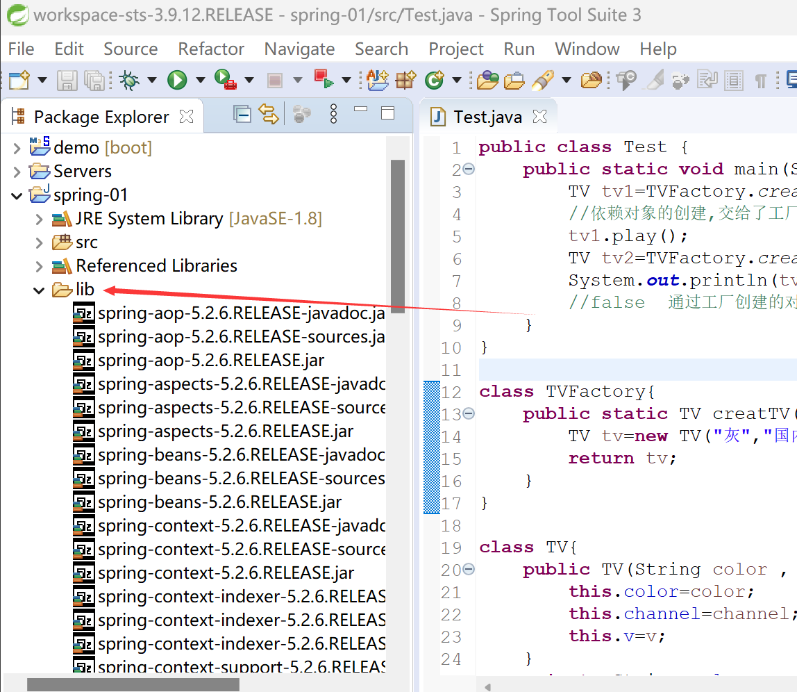

# Build Path
1. 步骤一：创建一个folder(文件夹)装下要build的文件 
2. 步骤二：将文件存入之前创建的folder中 
3. 步骤三：将folder中所有的文件全选中之后build-path -> Add to build path
	- 全部选中：选第一个后按住Shift之后选最后一个
	- 加入前：build-path -> Add to build Path(添加)
	- 加入后：build-path -> Configure build Path(编辑/修改)
	- 效果 
4. 添加后就会生成Referenced Libraries 
