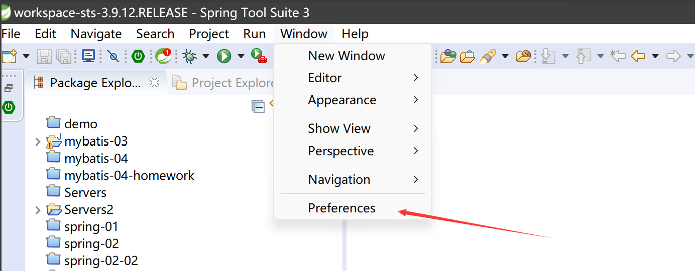
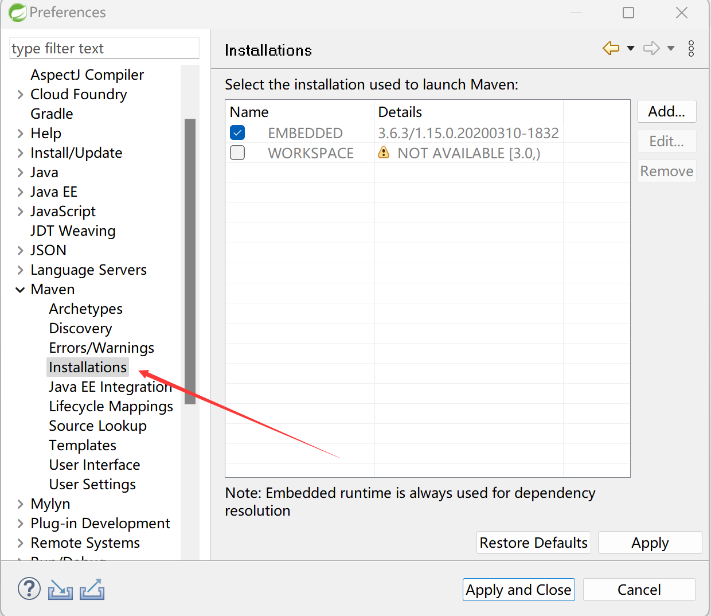
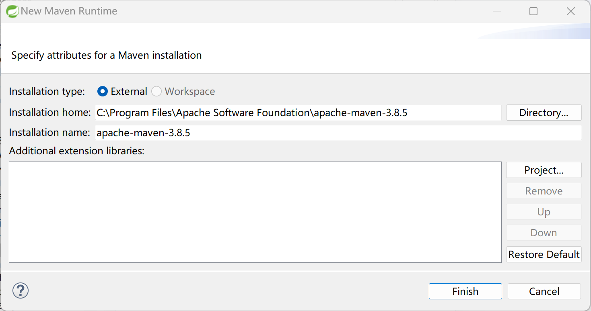
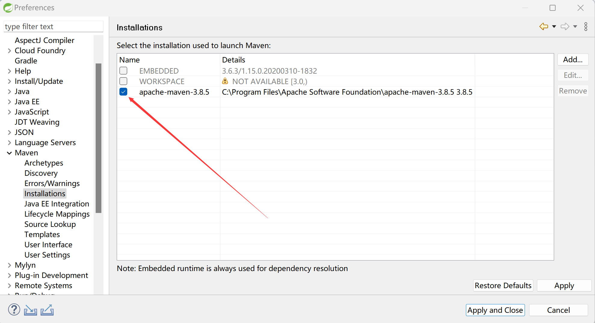
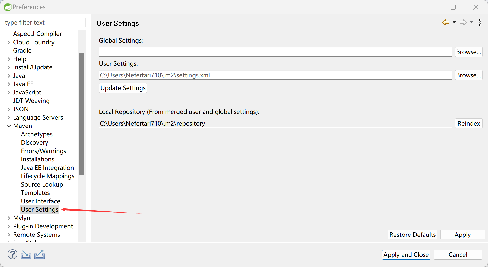
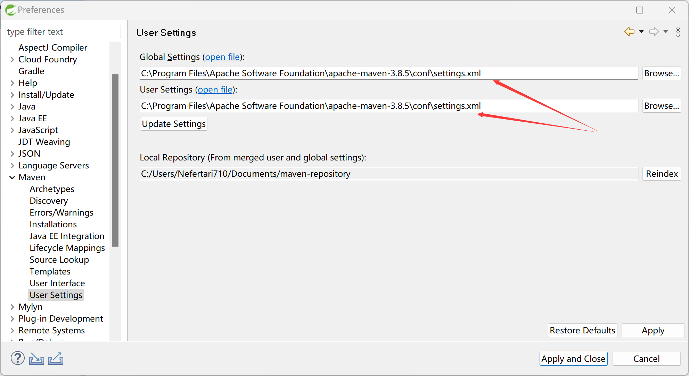
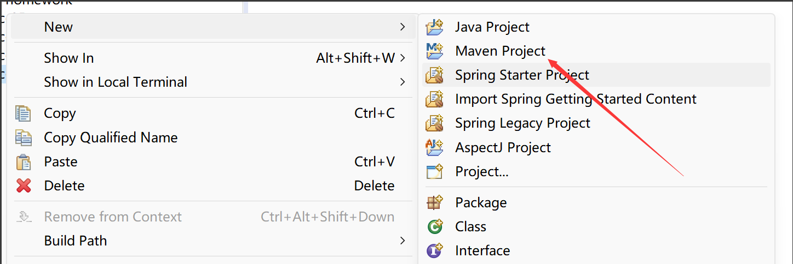
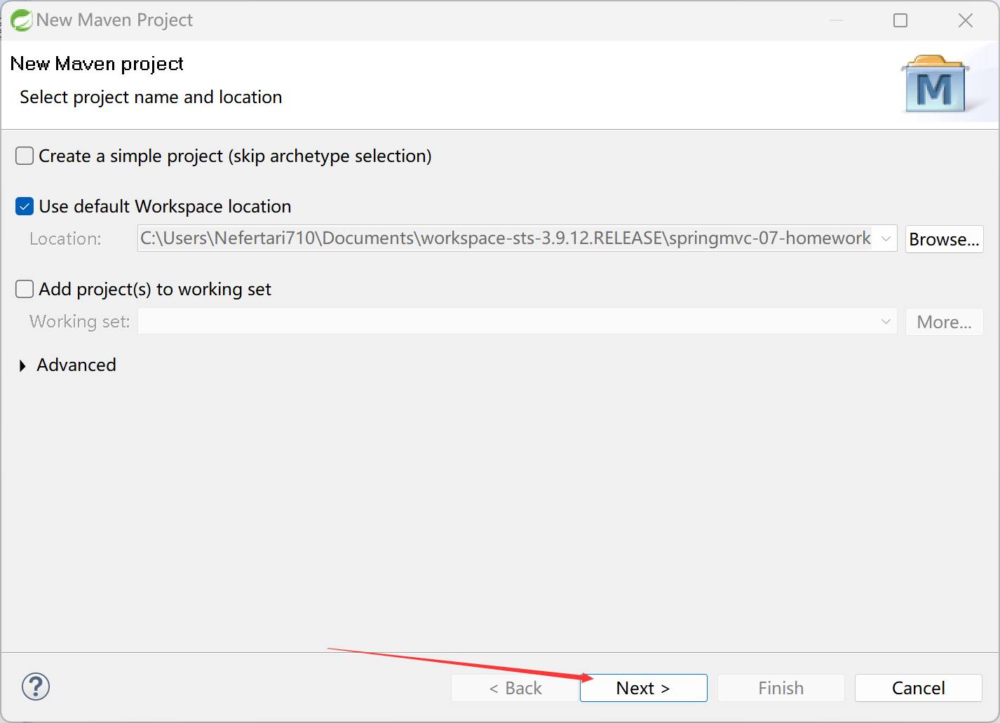
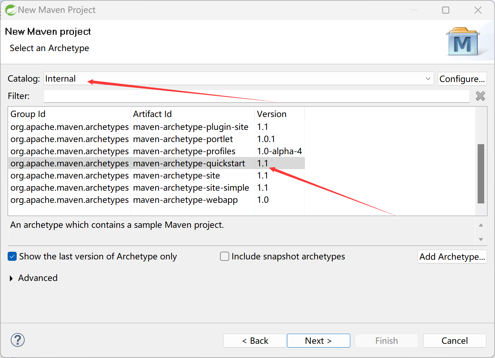
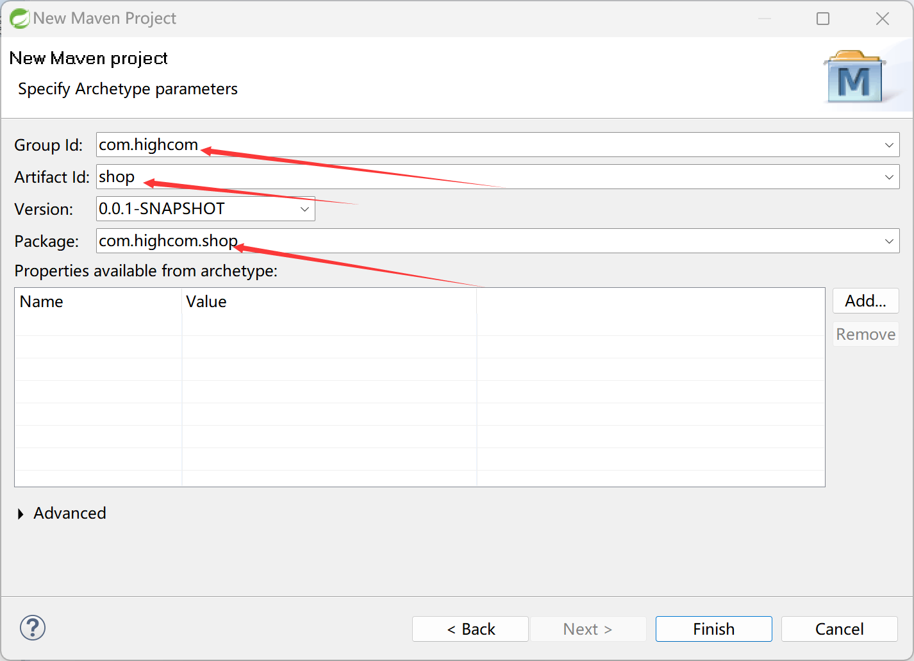

1. window-> preference
2.  Maven --> installation
3. 点击Add, 找到maven的安装位置,添加maven
4. 出现maven后一定要勾选
5. Maven --> User Settings 
6. Global Settings 和 User Settings 都指向maven的配置文件setting.xml
	- 最下面的那个是系统根据你的setting.xml文件自己找到的本地仓库，如果是就不用进行修改了
7. 最后Apply and Close就行了
8. 创建一个maven项目
9. 直接下一步
10. 上面的输入行选择Internet，下面的选择quickstart
11. 上面两个自己随便填，最下面的那个是系统自动生成的包，随便修改