## 在eclipse中配置和tomcat的集成 
<<<<<<< HEAD
1. 我们需要点击右上角JAVAEE图标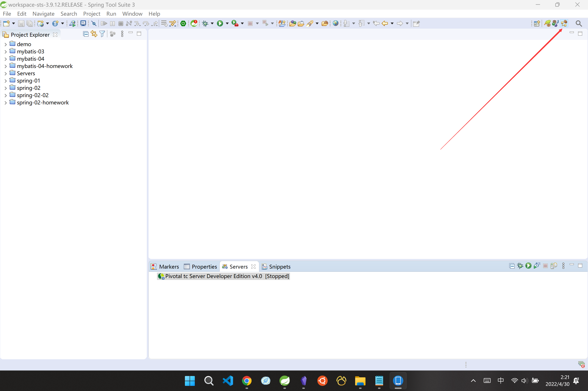
2. 如果没有，我们可以通过以下方式添加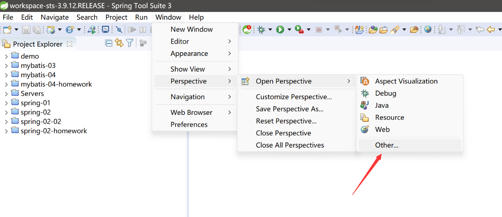
3. 点击other之后我们选择JAVAEE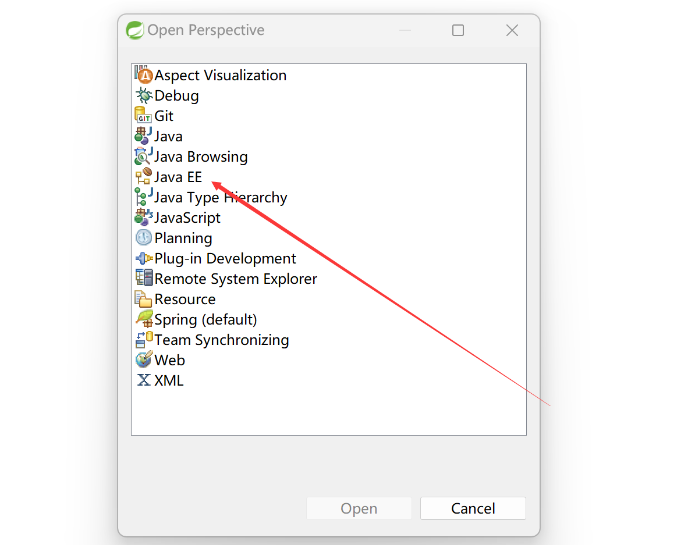
4. 我们点击右上角图标后会有下面的这个servers出现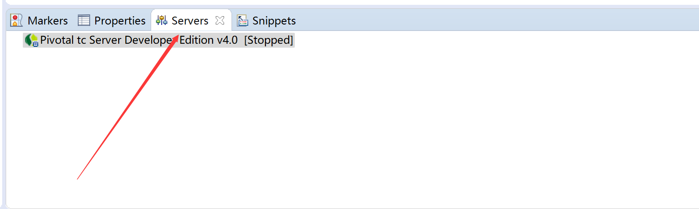
5. 新建一个新的server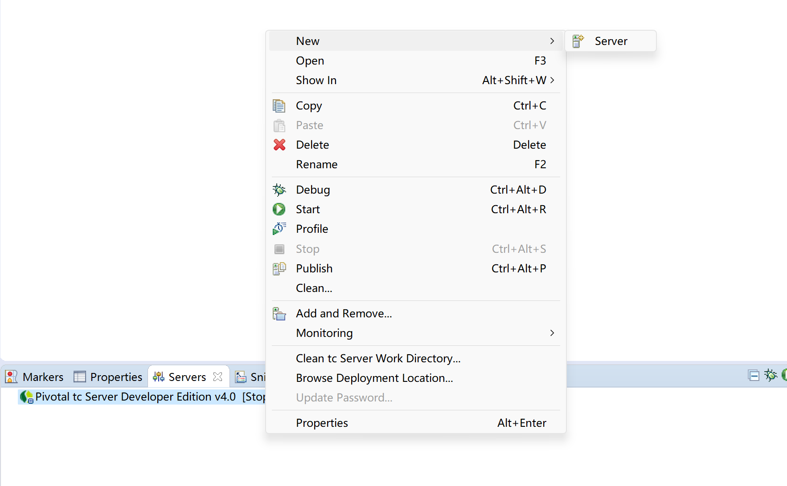
6. 选择tomcat对应的版本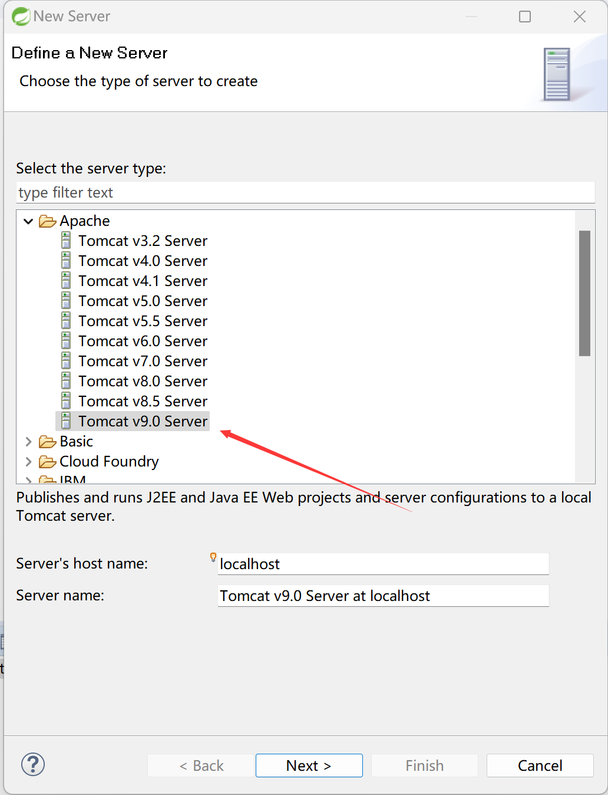
7. Tomcat installation directory选择tomcat文件夹，jdk选择对应版本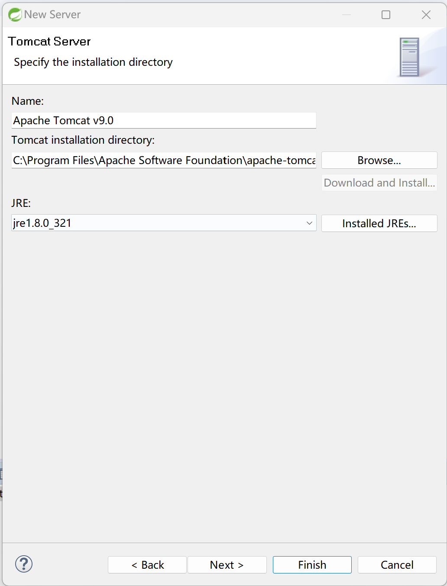
8. 最后一页不做添加直接结束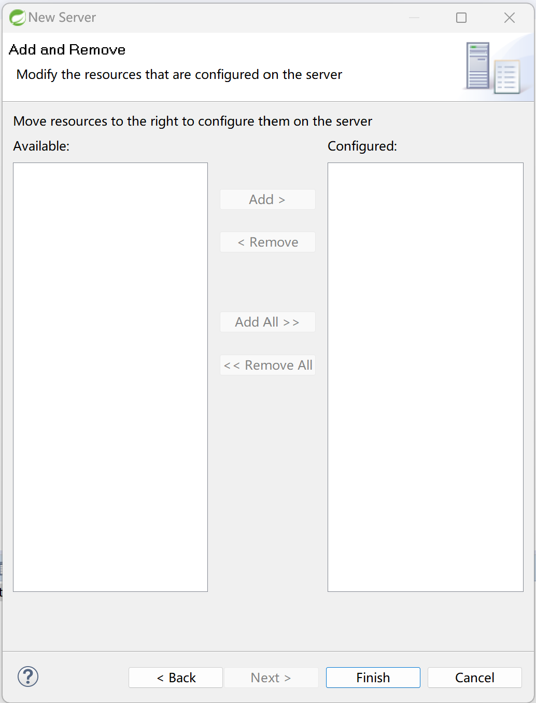
9. 经过操作就会在servers窗口中出现tomcat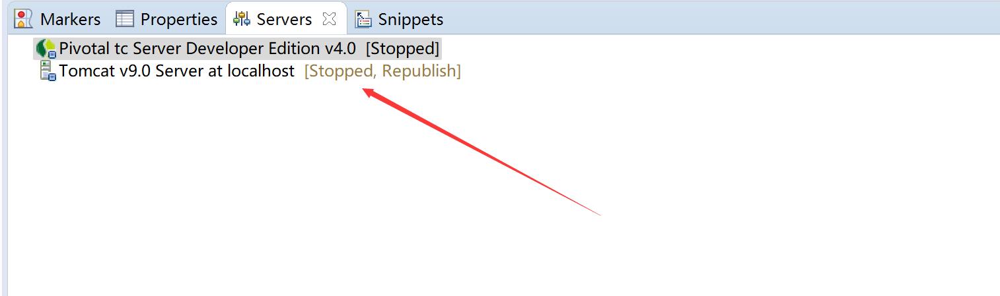
10. 配置完成可以通过STS进行启动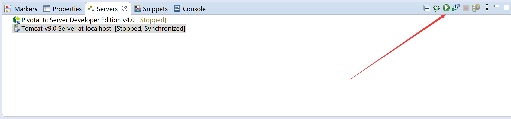
11. 也可以停止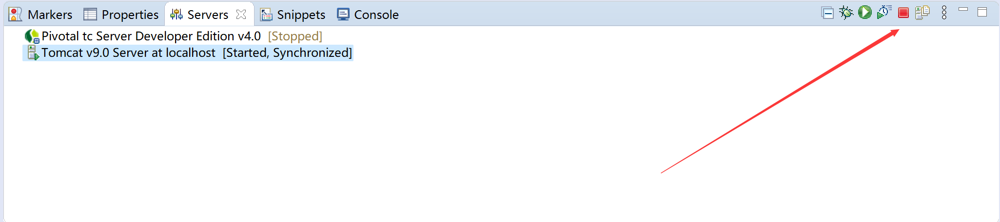
	- 注意：如果在STS中启动就不要在命令行启动
12. 当我们配置完之后自动会生成一个server文件不要关闭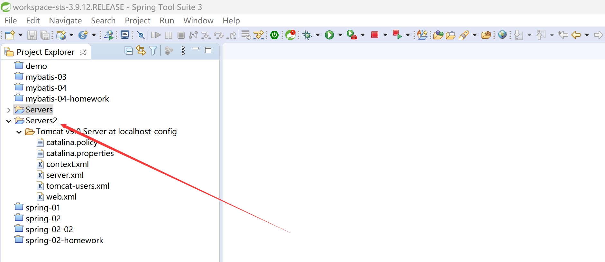
=======
1. 我们需要点击右上角JAVAEE图标
2. 如果没有，我们可以通过以下方式添加![[ER76$]Z_6%W1%80SIVZZ1JR.png]]
3. 点击other之后我们选择JAVAEE![[1[2M9%YTP8IN5~A8~375G~7.png]]
4. 我们点击右上角图标后会有下面的这个servers出现![[1ZZNB}H1LPE%U$SCJ($JV61.png]]
5. 新建一个新的server![[Pasted image 20220430022812.png]]
6. 选择tomcat对应的版本![[~PI8HR6DB8O0HJ[3]TR}WDJ.png]]
7. Tomcat installation directory选择tomcat文件夹，jdk选择对应版本![[Pasted image 20220430023254.png]]
8. 最后一页不做添加直接结束![[Pasted image 20220430023327.png]]
9. 经过操作就会在servers窗口中出现tomcat![[EUME1GYYU_JM4F2}@J8$RKQ.png]]
10. 配置完成可以通过STS进行启动![[W%YH[WW{XCD7Q~R~Z3`Q`N2.png]]
11. 也可以停止![[QOR1_E)8~DR5~)G(PIN2(1T.png]]
	- 注意：如果在STS中启动就不要在命令行启动
12. 当我们配置完之后自动会生成一个server文件不要关闭![[274KTMDQDE}8I7TJ_4`I8%G.png]]
>>>>>>> f62c6924b299b2b8811bb2f4f7b017731cc5d784
