# 闲言碎语
1. 点名按正常时间点名- 一分钟内完成
2. 没来的同学算旷课//来了的算迟到
3. 提问: 会记录回答情况，不在的话会算作旷课
4. 作业: 会在App上进行发布 --- 也就是微信群中
5. 上课时间1:30-4:30 延长至5:00

# 课程内容
1. 框架 + 项目
2. 老师认为我们应该有的基础
	- JAVA-SE
	- JDBC
	- MVC(JSP-SERVLET)
	- 项目架构
3. 我们明确要学的内容
	- Spring框架   ^76c392
	- Mybatis框架 持久层 -- 又称为IOC
	- SpringMVC MVC流程框架
	- Maven标准项目生命周期管理工具
	- Git GitHub Gitee版本相关管理
	- 集中体现就是我们最后的项目
4. 我们应该准备的环境
	- JDK 8以上 - -老师用的JDK8 / 11 / 17
	- mysql 5以上版本 -- 老师用的8
	- eclipse / STS -- 老师用的是STS一个绿色的图标
	- 不建议使用idea -- 老师不会解答相关问题
	- tomcat 8.5以上 （目前已经升级到10了）
	- git 和 maven 用的时候再说

# 课程核心
## 第一天的内容
1. 工厂模式
    - 定义：工厂模式属于创建型的设计模式，他创建的每一个对象都是不同的
	- 最主要的意义：把对象创建过程与本身解耦 -- 实现高内聚低耦合
	- 代码示例--(spring-01程序)&ensp;
```java
	public class Test {
		public static void main(String[] args) {
			TV tv1=TVFactory.creatTV();  
			//依赖对象的创建,交给了工厂类,最大的好处,是让对象的创建过程和应用本身解耦
			tv1.play();
			TV tv2=TVFactory.creatTV();		
			System.out.println(tv1==tv2);  
			//false  通过工厂创建的对象,每一个都是新的对象实例 
			}
		}
		
		class TVFactory{
			public static TV creatTV() {
				TV tv=new TV("灰","国内", 220);
				return tv;
			}
		}
		
		class TV{
			public TV(String color , String channel, int v){
				this.color=color;
				this.channel=channel;
				this.v=v;	
			}
			private String color;
			private String channel;
			private int v;
			
			public void play() {
				System.out.println(v+" 伏电压供应完成,电视开始播放");
				System.out.println("色彩"+color);
				System.out.println("频道"+channel);
			}
		}
```
2. Spring框架
    1. 定义以及重要部分介绍： Spring是一个开源，控制反转(IOC),和面向对象切面(AOP)的容器框架
    2. 简单介绍
        1.  IOC(Inversion of conrtol)
			- 应用本身不负责依赖对象的创建，而是把他们的创建控制权给外部容器，这样对象的控制权就由应用本身转到外部容器，控制权的转移就是转移反转
			- 传统的程序
			```java
			class UserServlet{
				//dao就是一个依赖对象，在这里直接new出来，这就是由应用本身负责依赖对象的创建
				private IUserDao dao = new UserDaoImpl();
				void service(){
					dao.login();
				}
			}
			```
            - 控制反转 
		        - 代码部分
				```java
				class UserServlet{
					//这个dao对象，将来是有"别人",也就是外部程序进行创建，然后传给"我们"
					public UseServlet(IUserDao dao){
						this.dao = dao;
					}
					//dao是一个依赖对象但是不由应用本身创建
					void service(){
						dao.login();
					}
				}
				```
				- 当其他程序需要调用UserServlet的时候
			```java
			IUserDao dao = new UserDaoImpl();
			UserServlet servlet = new UserServlet(dao);
			```
		2. 依赖注入(DI)
			- 定义：在程序运行期，由外部容器，把依赖对象动态的传过来的过程，就叫做依赖注入
			- 人话：把需要的"对象"传送过来
		```java
		class UserServlet{
			private IUserDao dao;
			void service(){
				dao.login();
			}
			//这个方法是专门留给外部容器调用的，在运行期把对象传过来
			public void setDao(IuserDao dao){
				this.dao = dao;
			}
		}
		```
		
		3.  AOP面向切面编程
3. Spring示例
	1. 导包 - 导入之后不要忘记添加到构建路径中
		- build-path:[[Build_path]]
	2. 配置文件 - applicationContext.xml [[配置文件]]
		- 放置在src目录下就可以(类路径下) --- 图标为田字格==文件夹==就是类路径
		- 配置文件说明
		```xml
		<?xml version="1.0" encoding="UTF-8"?>
		<beans xmlns="http://www.springframework.org/schema/beans"
			xmlns:xsi="http://www.w3.org/2001/XMLSchema-instance"
			xsi:schemaLocation="http://www.springframework.org/schema/beans http://www.springframework.org/schema/beans/spring-beans.xsd">
			
			<bean name="userInfo_name" class="com.beans.UserInfo">
				<property name = "id" value = "99" />
				<property name = "userName" value = "admin" />
				<property name = "password" value = "123" />
				<property name = "note" value = "这是一个来源于spring的对象" />
			</bean>
			<bean name="userInfo_mayuqian" class="com.beans.UserInfo">
			</bean>
		
		</beans>

		```
	3. 测试
		- 代码部分
		```java
		package com.Test;
		import org.springframework.context.support.ClassPathXmlApplicationContext;
		import com.beans.UserInfo;
		public class Test {
			public static void main(String[] args) {
				//初始化容器对象,从类路径下加载配置文件
				try ( ClassPathXmlApplicationContext ioc = new ClassPathXmlApplicationContext("applicationContext.xml")) {
					//从容器中得到一个bean 
					//上面的这两个在applicationContext.xml配置文件中我们都写了，所以可以获取的到
					UserInfo user = ioc.getBean("userInfo_mayuqian",UserInfo.class);	
					UserInfo user1 = ioc.getBean("userInfo_name",UserInfo.class);
					//下面的这个因为在配置文件没有写所以就不会获取而是会报错
					//UserInfo user2 = ioc.getBean("user",UserInfo.class);
					System.out.println(user);
					System.out.println(user1);
					//System.out.println(user2);
				}
			}
		}
	
		```
		- 测试结果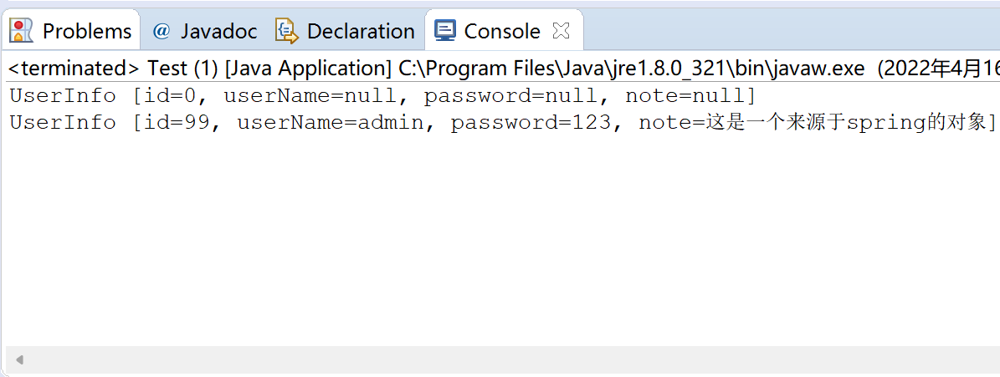
	    - spring的配置文件是可以有多个的,在加载的时候,也可以同时加载多个
			new ClassPathXmlApplicationContext("配置文件1.xml", "配置文件2.xml", ...  );
4. setter方式注入
	1.  讨论的是如何将依赖对象传递给应用
	2.  几种主流的方法
		- setter方法
		- 构造方法(不研究)
		- 静态工厂(不研究)
		- 实例工厂(不研究)
	3. 我们只研究setter方法注入
		1. 创建接口
		```java
		package com.dao;
		public interface IUserDao {
			void addUser();
			void updateUser();
			void deleteUser();
		}
		```
		2. 实现接口
		```java
		package com.dao.impl;
		import com.dao.IUserDao;
		public class UserDaoImplMySql implements IUserDao{
			public void addUser() {
				System.out.println("addUser 方法调用了  mysql实现");
			}
		
			public void updateUser() {
				System.out.println(" updateUser 方法调用了  mysql实现");
			}
		
			public void deleteUser() {
				System.out.println("deleteUser 方法调用了  mysql实现");
			}
		}
		``` 
		3. 模拟一个控制层 Servlet
		```java
		package com.controller;
		import com.dao.IUserDao;
		public class UserServlet {	
			//依赖对象
			private IUserDao dao;
			
			public void setDao(IUserDao dao) {
				this.dao = dao;
			}
		
			public void service() {
				dao.addUser();
				dao.updateUser();
				dao.deleteUser();	
			}
		}
		```
		4. 配置文件
			- 代码部分
			```java
			<bean name="userServlet_name" class="com.controller.UserServlet">
				<property name="dao" ref="daoImpMysql" />
			</bean>
			<bean name="daoImpMysql" class="com.dao.impl.UserDaoImplMySql" />
					
			```
			- 可以看到,上面是用 ref的方式建立起来两个bean之间的关联(相当于建立两个类的关联)
		5. 测试
			- 代码部分
			```java
			public static void main(String[] args) {
				//初始化容器对象,从类路径下加载配置文件 
				ClassPathXmlApplicationContext ioc=new ClassPathXmlApplicationContext("applicationContext.xml");
			
				UserServlet servlet=ioc.getBean("userServlet_name",UserServlet.class );
				
				servlet.service();
			}
			```
			 -  测试结果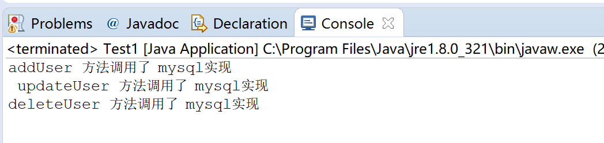
		6. 我们可以再编写一个 IUserDao 的实现类
		```java
		package com.dao.impl;
		import com.dao.IUserDao;
		public class UserDaoImplOracle implements IUserDao {
			public void addUser() {
				System.out.println("addUser 方法调用了 oracle实现");
			}
		
			public void updateUser() {
				System.out.println("updateUser 方法调用了 oracle实现");
			}
		
			public void deleteUser() {
				System.out.println("deleteUser 方法调用了 oracle实现");
			}
		}
		```
		7. 配置文件
			- 代码部分
			```xml
			<bean name="userServlet_name" class="com.controller.UserServlet">
				<property name="dao" ref="daoImpOracle" />
			</bean>
			
			<bean name="daoImpMysql" class="com.dao.impl.UserDaoImplMySql" />	
			<bean name="daoImpOracle" class="com.dao.impl.UserDaoImplOracle" />
			``` 
			- 可以看到,可以很轻易的在 在两个不同的实现类之间进行选择
		8. 测试新的Oracle实现类
			- 代码部分
			```java
			package com.Test;
			import org.springframework.context.support.ClassPathXmlApplicationContext;
			import com.controller.UserServlet;
			
			public class Test1 {
				public static void main(String[] arg) {
				ClassPathXmlApplicationContext ioc = new ClassPathXmlApplicationContext("applicationContext.xml");
				UserServlet servlet1 = ioc.getBean("userServlet_name_Oracle",UserServlet.class);
				servlet1.service();
				}
			}
			```
			- 测试结果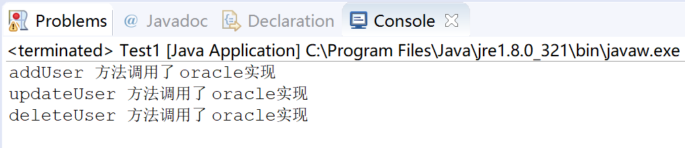
5. bean的作用域
	1. 上面的例子中，我们从Spring容器中得到的bean是单实例的还是多实例的
		- 代码部分
		```java
		public static void main(String[] args) {
			ClassPathXmlApplicationContext ioc=new ClassPathXmlApplicationContext("applicationContext.xml");
			UserServlet servlet1=ioc.getBean("userServlet_name",UserServlet.class );
			UserServlet servlet2=ioc.getBean("userServlet_name",UserServlet.class );
			System.out.println(servlet1==servlet2);  //true 
			//表示的两个servlet指向的是一个相同的地址，所以是同一个对象 
		}
		```
		- 可以看到在默认的情况下得到的bean是单实例的
	2. 当然Spring中管理bean，有几种作用域(scope的取值)
		1.  singleton: 是默认值，表示创建的是单实例 - 默认情况不写
		    1. 位置
			```xml
			<bean name="userInfo_name" class="com.beans.UserInfo" scope="singleton">
			
			</bean>	
			```
			2. 问题：这个单实例的bean是在什么时候创建的？实在初始化Spring容器的时候还是我们向Spring申请一个bean的时候？
			3. 回答：它是在容器初始化的时候创建的
			4. 改变条件：这个行为是可以改变的，可以添加参数 lazy-init = “true”表示不要在容器初始化的时候创建，而是在程序申请的时候才创建
			```xml
			<bean name="userInfo_name" class="com.beans.UserInfo"  lazy-init="true">
				
			</bean>
			```
			5. 如果希望所有的bean全是这样，也可以在全局beans标签上进行配置，如下
			```xml
			<beans default-lazy-init="true"  ...   >
			```
			6. 单例例子
				- 配置文件
				- 测试文件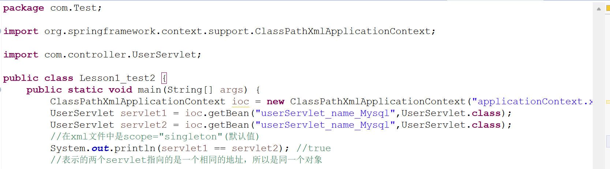
				- 测试结果 true  
		2. prototype
			- 这个取值，表示每次都将产生一个新的对象
			- 问题：什么时候使用单实例，什么时候使用多实例
			- 答案：没有线程安全问题就可以使用单实例，否则就用多实例
			- 单实例比如：通常一些工具类，dao，往往没有线程安全问题我们就使用单实例
			- 多实例比如：控制层可能存在线程安全问题，我们就要是用多实例
			- 多例例子
				- 配置文件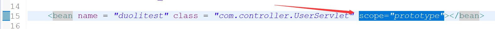
				- 测试文件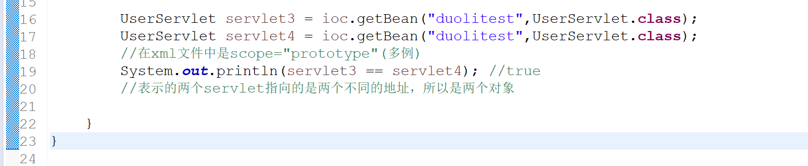
				- 测试结果false
		3. request(不做细化介绍)
		4. session(不做细化介绍)
6. 集合类型的装配
	- set集合
	- map集合
		```java
		public class UserServlet {	
		//依赖对象
			private IUserDao dao;
			
			//set集合
			private Set<String> mySet;
			
			//map集合
			private Map<String,String> myMap;
			
			public void service() {
				dao.addUser();
				dao.updateUser();
				dao.deleteUser();	
				
				mySet.forEach( e->System.out.println(e));
				
				myMap.forEach((k,v)->System.out.println(k+":"+v));
			}
			
			public void setMySet(Set<String> mySet) {
				this.mySet = mySet;
			}
			
			public void setMyMap(Map<String, String> myMap) {
				this.myMap = myMap;
			}
			
			//这个方法,是留给spring容器调用的,帮我们传入依赖对象
			public void setDao(IUserDao dao) {
				this.dao = dao;
			}
		}
		```
		```xml
		<bean name="userServlet_name" class="com.controller.UserServlet">
			<property name="dao" ref="daoImpMysql" />
			
			<property name="mySet">
				<set>
					<value>子弹</value>
					<value>炸药</value>
					<value>刺刀</value>
			    </set>
			</property>
			
			<property name="myMap">
				<map>
					<entry key="GUN_01"  value="AK47" />
					<entry key="GUN_02"  value="M762" />
					<entry key="GUN_03"  value="AWM" />
				</map>
			</property>
		</bean>
		```
		- 注入后的输出效果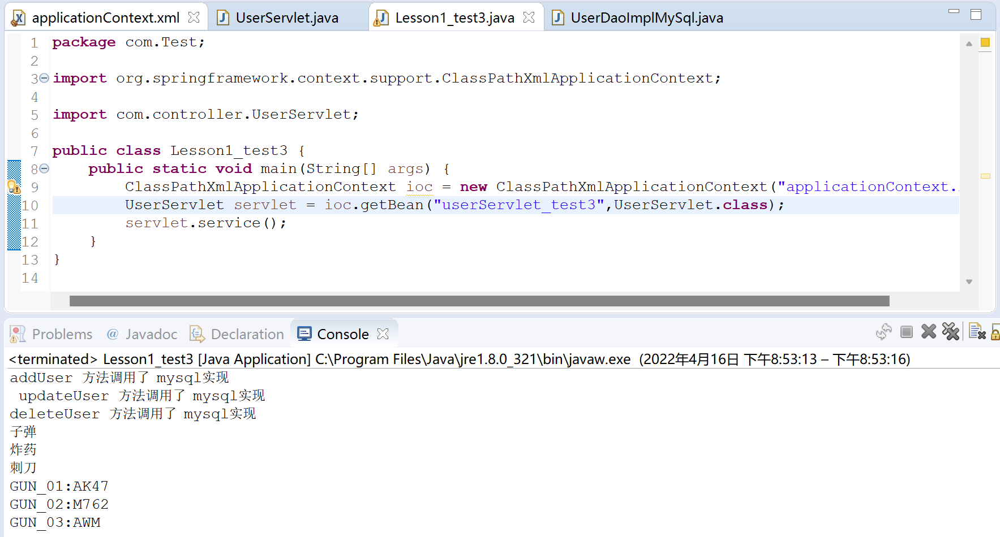
7. p名称空间
	- 先需要选中p名称空间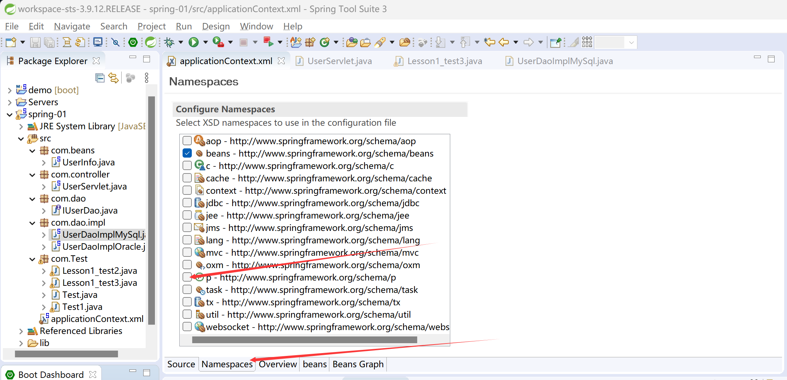
	- 选中后bean可以按下面的方式写
	```xml
	<!--相当于省略原有的property改为p的形式-->
	<bean name="userInfo_name"  class="com.beans.UserInfo" 
	   p:userName="root"
	   p:password="admin123"
	   p:id="20"
	   p:note="这是一个用了p名称空间的类" />	
	```
	- 附 关于名称空间
		```java
		<?xml version="1.0" encoding="UTF-8"?>   
		//上面这行是xml文档声明,前面不能有任何字符
					
		<beans xmlns="http://www.springframework.org/schema/beans"
			xmlns:xsi="http://www.w3.org/2001/XMLSchema-instance"
			xmlns:p="http://www.springframework.org/schema/p"
			xsi:schemaLocation="http://www.springframework.org/schema/beans http://www.springframework.org/schema/beans/spring-beans.xsd">
											   
		```
		- xmlns ==> xml name space 	称为xml名称空间	
		- 使用默认名称空间中的内容,可以不用加前缀,用其他名称空间中的内容,一般都是要加前缀的	

## 第二天的内容
1. 知识储备
	-  环境变量的配置
		1. 安装JDK  1.8   17  
			- windows+r 打开DOS窗口
			- Java -version 查看JDK版本
			- set JAVA_HOME 查看环境变量JAVA_HOME的配置
			- set Path 查看环境变量Path的配置
		2. 配置Path()
	    ```Path
		Path ==> %JAVA_HOME%\bin;
		```
2. 回顾
	创建了一个Spring项目
		UserServlet
			IUserDao dao
		UserDaoImpMysql
		UserDaoImpOracle
3. 自动扫描
	介绍：从spring2.5开始，可以用注释的方式，以自动扫描的形式把spring中的bean纳入spring管理
	1. 引入context名称空间
		- 在Namespaces处选中context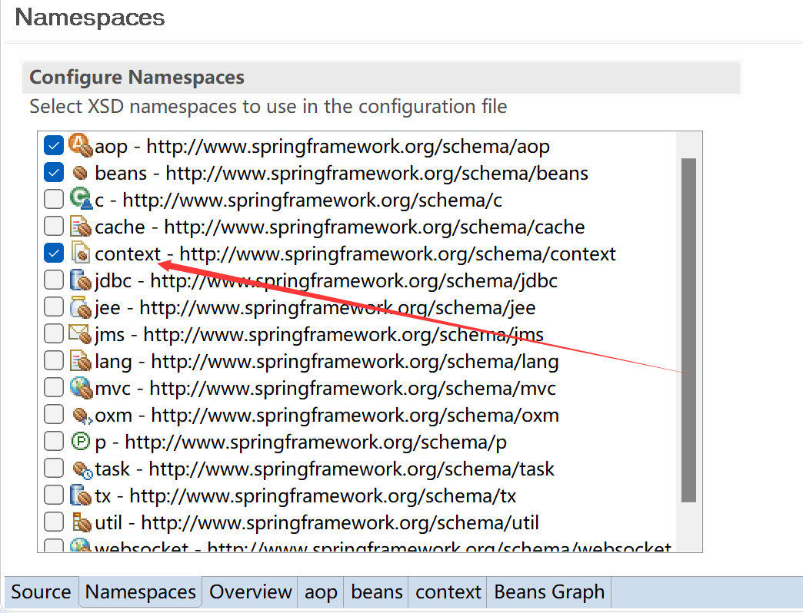
		- 内容
		```xml
		<?xml version="1.0" encoding="UTF-8"?>
		<beans xmlns="http://www.springframework.org/schema/beans"
			xmlns:xsi="http://www.w3.org/2001/XMLSchema-instance"
			xmlns:context="http://www.springframework.org/schema/context"
			xsi:schemaLocation="http://www.springframework.org/schema/beans http://www.springframework.org/schema/beans/spring-beans.xsd
				http://www.springframework.org/schema/context http://www.springframework.org/schema/context/spring-context-4.3.xsd">
			
		</beans>
		```
		- 引入之后配置文件发生变化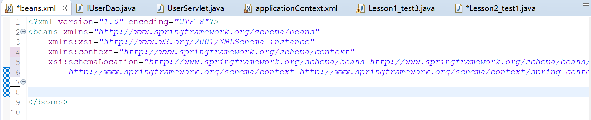
	2. 开启自动扫描
		- 它会自动的扫描指定的包和子包里的类，把他们纳入spring容器进行管理
		```java
		<context:component-scan base-package="com.controller" />
		<context:component-scan base-package="com.dao.impl" />
		```
		- 这些类必须带有以下注解之一
			- @Controller 用于控制层
				- 注解样式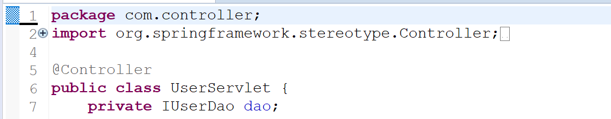
			- @Service 用于业务层
			- @Repository 用于持久层
				- 注解样式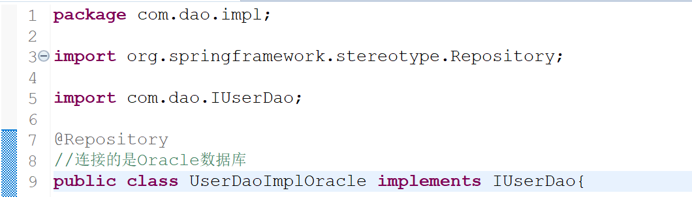
			- @Component 用于其他组件
		- 以自动扫描的方式纳入spring管理的beans，有默认名称，默认名称就是类型小写
			- 默认就是小写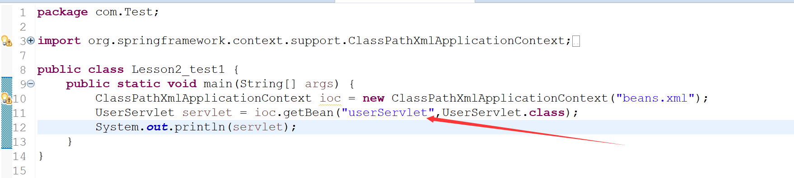
			- 输出结果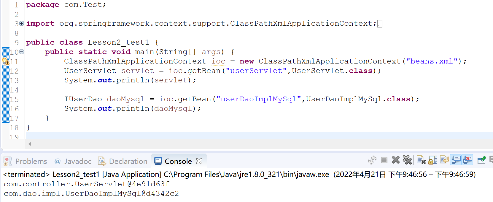
		- 我们也可以自己指定名称
			- 代码段
			```java
			@Repository("daoMysql")
			public class UserDaoImplMySql implements IUserDao{
			}	
			```
			- 实例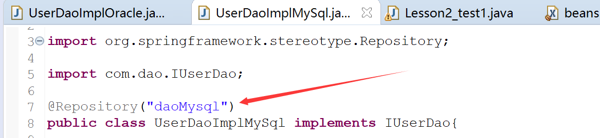
			- 输出结果!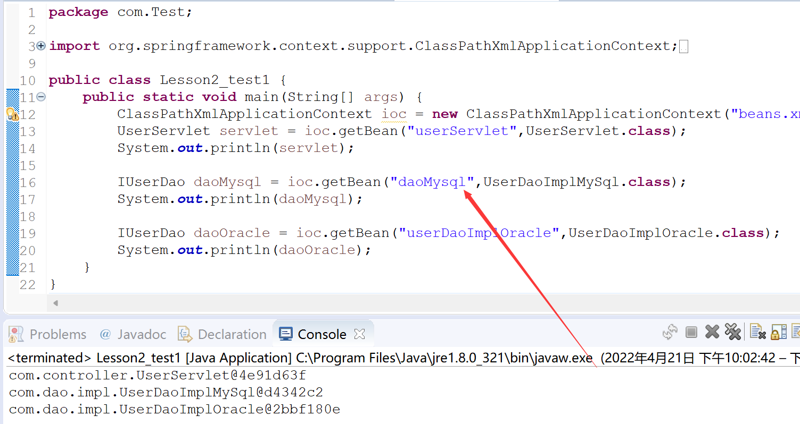
		- 用注解方式管理bean默认的单实例，如果想配置成多实例
			- 代码段
			```java
			//依旧是使用scope关键字，但是这次是使用注解的方式
			@Repository("daoOrcle")  @Scope("prototype")
			public class UserDaoImplOracle implements IUserDao {
			}
			```
			- 示例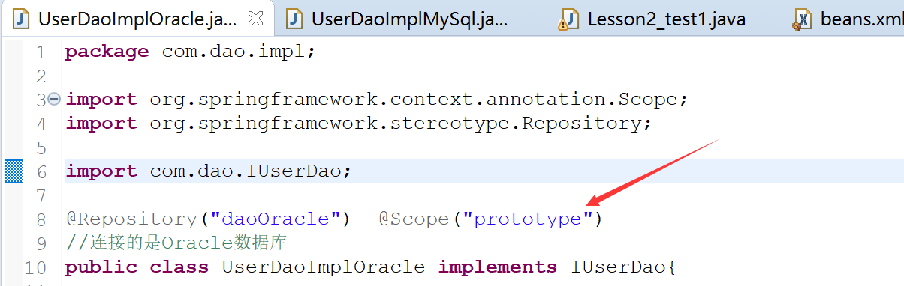
			- 示例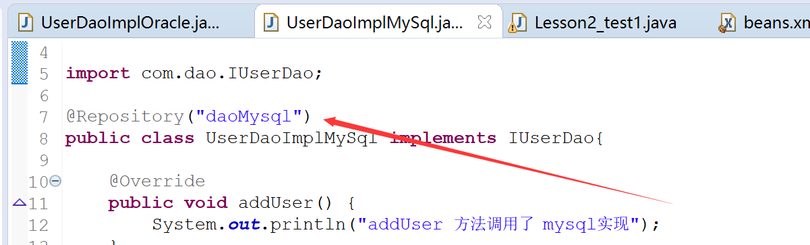
			- 输出对比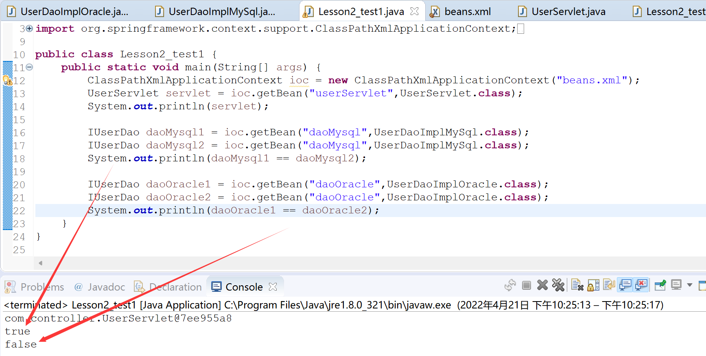
4. 注解装配
	1. 解决的是依赖注入的问题
	```java
	package com.controller;
	import javax.annotation.Resource;
	
	import org.springframework.stereotype.Controller;
	import com.dao.IUserDao;
	
	@Controller
	public class UserServlet {		
		@Resource(name="daoOrcle") 
		private IUserDao dao;
		//因为我们写了两个实现类所以当我们直接使用Resource的时候会出现注入异常
		//我们应该在后面括号内注明我们要注入哪一个类
		
		public  void service() {
			dao.addUser();
			dao.updateUser();
			dao.deleteUser();
		}
	}
	```
	2. 说明：
		1. @Resource注解
			- @Resource注解是javax.annotation.Resource;
			- 在JDK9之后，如果想应用就要先导包
			- @Resource注解，默认是按照名称进行装配，再按类型进行装配，如果给制定了名称就一定要严格按照名称进行装配
			- 按类型进行装配的时候，如果找到多个匹配类型就会报错，因为他不能确定到底装配的是哪个类对象，这时我们必须严格指定名称
		2. @Autowired注解
			- 它是org.springframework.beans.factory.annotation.Autowired;
			-  @Autowired默认是按类型进行装配 
				- 第一时间会去找类型为IUserDao的，而不是找名字为dao的
			- 它本身没有name属性，如果要明确指明类型要和 @Qualifier注解配合使用
		```java
		@Controller
		public class UserServlet {	
			@Autowired @Qualifier("daoMysql")
			private IUserDao dao;	
			public  void service() {
				dao.addUser();
				dao.updateUser();
				dao.deleteUser();
			}
		}
	```
5. AOP编程的一些概念(AOP面向切面编程)
	- ==Aspect 切面==  -- 横切性关注点的抽象(针对很多对象)
	- ==Joinpoint连接点== -- 被拦截到的点，在Spring中，指的是被拦截到的方法
		- AOP类似于高速公路，JoinPoint就是检查站
		- 我们想要计算一个方法的运行时间就可以使用拦截的方式，拦截到的方法就计算运行时间
	- ==PointCut切入点== -- 指的是哪些连接点要进行拦截，比如拦截所有以get开头的方法，在Spring中可以用相关的表达式去定义(类似于css的选择器)
	- ==Advice通知== -- 拦到Joinpoint之后要做的事，
		- 有前置通知，最终通知，例外通知，环绕通知
	- ==target目标对象== -- 被拦到的对象(随后会详细进行讲解)
	- ==Veave织入==-- 将Aspect应用于目标对象的过程，经过织入，代理对象就产生了
6. Spring中进行AOP编程
	- Spring中，进行AOP编程，主要有两种方式
	1. 注解方式 
		1. 导入相关的包 
			- 可以用maven进行依赖的获取
		2. 配置文件
			- 打开AOP名称空间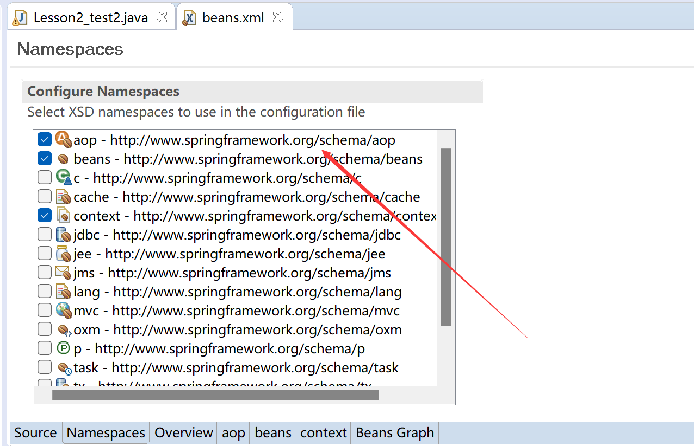
			- 然后对配置文件进行修改
				- 代码段
				```xml
				<aop:aspectj-autoproxy />
				```
				- 图示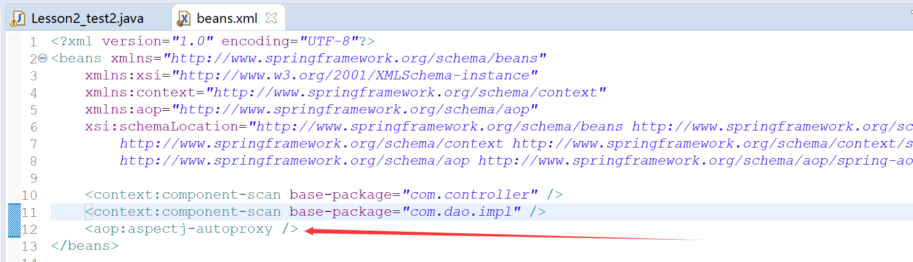
		3. 接口
		```java
		public interface IUserDao {
			void addUser();
			void updateUser();
			void deleteUser();
			UserInfo getUser(int id );
			UserInfo login(String userName,String password);
		}
		```
		4. 实现类
		```java
		package com.dao.impl;
		import org.springframework.stereotype.Repository;
		import com.beans.UserInfo;
		import com.dao.IUserDao;
		//因为我们要交给Spring所以一定要记得写下面的注解!!!!
		@Repository
		public class UserDaoImpl implements IUserDao{
			public void addUser() {
				System.out.println("addUser 方法调用了  mysql实现");
			}
		
			public void updateUser() {
				System.out.println(" updateUser 方法调用了  mysql实现");
			}
		
			public void deleteUser() {
				System.out.println("deleteUser 方法调用了  mysql实现");
			}
		
			public UserInfo getUser(int id) {
				System.out.println("用户查询 getUser 方法得到了");
				if(id==1) {
					UserInfo user=new UserInfo();
					user.setId(1);
					user.setUserName("admin");
					return user;
				}
				
				return null;
			}
		
			public UserInfo login(String userName, String password) {
				System.out.println("登录 login 方法调用了");
				if("admin".equals(userName) &&"123".equals(password)) {
					UserInfo user=new UserInfo();
					user.setId(1);
					user.setUserName("admin");
					user.setPassword("123");
					return user;
				}
				return null;
			}
		}
		```
		5. 声明一个切面
			- 人话：我们要在高速上建一个检查站
		```java
		package com.aop;
		import org.aspectj.lang.JoinPoint;
		import org.aspectj.lang.annotation.*;
		import org.springframework.stereotype.Component;
		
		//一定要先举牌，component表示其他组件，Aspect代表的是切面
		@Component @Aspect
		public class MyAspect {
			
			//定义切入点
			//我们想要拦截返回值为什么类型*处就写什么
			//当我们想要拦截所有返回值类型的方法时用*
			//后面是拦截包所在位置，拦截UserDaoImpl下的所有方法就用*
			//最后的括号是拦截方法的参数，如果不在乎参数是啥就(..)
			@Pointcut("execution(* com.dao.impl.UserDaoImpl.*(..))")
			private void anyMethod() {}
			
			//拦截之前先执行before注解内的内容
			@Before("anyMethod()")
			public void beforMethod(JoinPoint point) {
				//方法名随便起主要是看注解的名字
				//Joinpoint就是连接点，就是拦截到的方法
				String methodName= point.getSignature().getName();
				//point.getArgs()获取参数
				//point.getTarget()获取执行该方法的对象
				//point.getSignature()获取方法签名
				System.out.println("方法"+methodName+ "秇行了 前置通知触发了");
			}
			
			//后置通知
			@AfterReturning("anyMethod()")
			public void afterMethod() {
				System.out.println("后置通知触发了");
			}
			
			//最终通知
			@After("anyMethod()")
			public void finallyMethod() {
				System.out.println("最终通知触发了");
			}
			
			//例外通知--当出现错误的时候就会激活例外通知
			@AfterThrowing("anyMethod()")
			public void exceptionMethod() {
				System.out.println("例外通知触发了");
			}
		}
		```
		6. 测试
			- 代码段
			```java
			package com.test;
			import org.springframework.context.support.ClassPathXmlApplicationContext;
			
			import com.controller.UserServlet;
			import com.dao.IUserDao;
			import com.dao.impl.UserDaoImpl;
			
			public class Test {
			
				public static void main(String[] args) {
					ClassPathXmlApplicationContext ioc=new ClassPathXmlApplicationContext("beans.xml");
					
					IUserDao dao=ioc.getBean("userDaoImpl",IUserDao.class);
					
					dao.getUser(2);
					
					dao.addUser();
				
					dao.deleteUser();
				}
			
			}	
			```
			- 可以看到每个方法的执行都触发了对应的通知, 如果方法执行中出现异常,将触发例外通知
			- 关于切入点的表达式
			```java
			@Pointcut("execution(* com.dao.impl.UserDaoImpl.*(..))")
			 com.dao.impl.UserDaoImpl  //表示要拦截的类
					 .*  //表示要拦截所有的方法
					 (..) //表示不管方法的参数有几个,也不管是什么类型
			```
1. AOP编程 环绕通知
	```java
	@Component @Aspect
	public class MyAspect {
		//定义切入点
		@Pointcut("execution(* com.dao.impl.UserDaoImpl.*(..))")
		private void anyMethod() {}
		//环绕通知--相当于上面的渐变方式
		@Around("anyMethod()")
		public Object aroundMethod( ProceedingJoinPoint point)  {
			//该方法有返回值且有参数
			Object result=null;
			try {
				//在point。proceed之前的就是前置通知
				System.out.println("环绕通知中的 前置通知触发了");
				
				//point.proceed()就是让被拦到目标方法执行
				result=point.proceed();		//有这句代表允许执行
				
				//在point.proceed之后就是后置通知
				System.out.println("环绕通知中的 后置通知触发了");
				
			} catch (Throwable e) {
				//所抛出的异常是Throwable的一个子类，所以异常类型是Throwable
				System.out.println("环绕通知中的后例外通知触发了");
			}finally{
				System.out.println("环绕通知中的最终通知触发了");
			}
			//后面的result可以强制改变返回值，即使有返回值也可以强制改成null
			return result;
		}
	}
	
	```
	- 测试
	```java
	public static void main(String[] args) {
		ClassPathXmlApplicationContext ioc=new ClassPathXmlApplicationContext("beans.xml");
		IUserDao dao=ioc.getBean("userDaoImpl",IUserDao.class);
		UserInfo user=dao.getUser(9);
		System.out.println(user);
	}
	```
	- 可以看到,用这种方式我们可以
		- 得到方法的名称,对应的调用者,方法的参数等相关信息从  ProceedingJoinPoint point 这个参数中就可以
		- 可以控制方法是否执行point.proceed(); 
			- 调用这个方法,就执行,
			- 不调用,就不执行
		- 可以控制方法的返回结果--直接修改return的值
8. AOP编程xml配置文件
	1. 如果用XML配置的方式,就不用再加各种注解了
	2. 实现类
	```java
	package com.aop;
	import org.aspectj.lang.ProceedingJoinPoint;
	import org.springframework.stereotype.Component;
		
	@Component 
	public class MyAspect {
		public Object aroundMethod( ProceedingJoinPoint point)  {
			Object result=null;
			
			try {
				System.out.println("环绕通知中的 前置通知触发了");
				//这个调用,就是让被拦到目标方法执行
				result=point.proceed();
				
				System.out.println("环绕通知中的 后置通知触发了");
				
			} catch (Throwable e) {
				System.out.println("环绕通知中的后例外通知触发了");
			}finally{
				System.out.println("环绕通知中的最终通知触发了");
			}
			
			return result;
		}
		
	
		public void beforMethod() {
			System.out.println("前置通知触发了");
		}
	
		public void afterMethod() {
			System.out.println("后置通知触发了");
		}
	
		public void finallyMethod() {
			System.out.println("最终通知触发了");
		}
		
		public void exceptionMethod() {
			System.out.println("例外通知触发了");
		} 
	}	
	```
	3. 配置文件
		1. 前置/后置/最终/例外通知配置文件
			- 代码部分
			```xml
			<aop:config>
			<aop:aspect ref="myAspect">
				<aop:pointcut expression="execution(* com.dao.impl.UserDaoImpl.*(..))" id="pointCutXXX"/>
				<aop:pointcut expression="execution(* com.dao.impl1.*(..))" id="pointCutYYY"/>
				<aop:before method="beforMethod" pointcut-ref="pointCutYYY" />
				<aop:before method="beforMethod" pointcut-ref="pointCutXXX" />
				<aop:after-returning method="afterMethod" pointcut-ref="pointCutXXX" />
				<aop:after method="finallyMethod" pointcut-ref="pointCutXXX" />
				<aop:after-throwing method="exceptionMethod" pointcut-ref="pointCutXXX" />
			</aop:aspect>
			</aop:config>
			```
			- 上面的id代表的我们要负责的部分，下面在声名通知的时候可以选择对应的管辖范围
			- 我们一般来讲不会这样使用，一般直接使用环绕通知
		2. 环绕通知配置文件
		```xml
		<aop:config>
			<aop:aspect ref="myAspect">
				<aop:pointcut expression="execution(* com.dao.impl.UserDaoImpl.*(..))" id="pointCutXXX"/>
				<aop:around method="aroundMethod"  pointcut-ref="pointCutXXX" />
			</aop:aspect>
		</aop:config>	
		```
1. Spring JDBC -- Spring-02-02
	1. 配置文件中进行配置数据源
	```xml
	<?xml version="1.0" encoding="UTF-8"?>
	<beans xmlns="http://www.springframework.org/schema/beans"
		xmlns:xsi="http://www.w3.org/2001/XMLSchema-instance"
		xmlns:context="http://www.springframework.org/schema/context"
		xmlns:aop="http://www.springframework.org/schema/aop"
		xsi:schemaLocation="http://www.springframework.org/schema/beans http://www.springframework.org/schema/beans/spring-beans.xsd
			http://www.springframework.org/schema/context http://www.springframework.org/schema/context/spring-context-4.3.xsd
			http://www.springframework.org/schema/aop http://www.springframework.org/schema/aop/spring-aop-4.3.xsd">
			
		<context:component-scan base-package="com" />
		
		<bean name="dataSource"  class="org.springframework.jdbc.datasource.DriverManagerDataSource">
			<property name="driverClassName" value="com.mysql.cj.jdbc.Driver"  />
			<property name="url" value="jdbc:mysql://localhost:3306/oa?useUnicode=true&amp;characterEncoding=UTF8&amp;serverTimezone=UTC&amp;useSSL=false&amp;allowPublicKeyRetrieval=true" />
			<property name="username" value="root" />
			<property name="password" value="root" />
		</bean>
	</beans>	
	```
	2. 导入mysql的驱动包,并添加到构建路径中
		- mysql-connector-java-8.0.12.jar
	3. dao层
	```java
	package com.dao.impl;
	import javax.annotation.Resource;
	import javax.sql.DataSource;
	import org.springframework.jdbc.core.BeanPropertyRowMapper;
	import org.springframework.jdbc.core.JdbcTemplate;
	import org.springframework.stereotype.Repository;
	import com.beans.UserInfo;
	
	@Repository
	public class UserDaoImpl {
		private JdbcTemplate t;   //这个类,是Spring提供的,一个传用于数据库操作的类
		
		@Resource  //让spring在运行的时候帮我们把 dataSource注起来
		public void SetDataSoruce(DataSource dataSource) {
			t=new JdbcTemplate(dataSource);
		}
		
		//添加用户
		public int addUser(UserInfo user) {
			String sql="insert into userInfo (userName,password,note) values (?,?,?) ";
			return t.update(sql, user.getUserName(),user.getPassword(),user.getNote());
		}
		
		//删除用户
		public int deleteUserById(int id){
			return t.update("delete from userInfo where id =? ",id);
		}
		
		//修改用户
		public int updateUser(UserInfo user) {
			String sql="update userInfo set userName=?, password=?,note=? where id =?" ;
			Object [] params= {
				user.getUserName(),
				user.getPassword(),
				user.getNote(),
				user.getId()
			};
			return t.update(sql, params);
		}
		
		//根据id查询用户
		public UserInfo getUserById(int id) {
			String sql="select * from userInfo where id=?";
			return t.queryForObject(sql,  new BeanPropertyRowMapper<UserInfo>(UserInfo.class),id);	
		}
	}
	```
	4. 测试
	```java
	package com.test;
	import org.springframework.context.support.ClassPathXmlApplicationContext;
	import com.beans.UserInfo;
	import com.dao.impl.UserDaoImpl;
	
	public class Test {
		public static void main(String[] args) {
			ClassPathXmlApplicationContext ioc=new ClassPathXmlApplicationContext("beans.xml");
			UserDaoImpl dao=ioc.getBean("userDaoImpl",UserDaoImpl.class);
			
			/* 添加用户
			UserInfo user=new UserInfo();
			user.setUserName("拜振华");
			user.setPassword("bzh");
			user.setNote("中国人民万岁");
			
			int result=dao.addUser(user);
			System.out.println(result==1?"添加成功":"添加失败");  */
			
			/*查询用户
			UserInfo user=dao.getUserById(5);
			System.out.println(user);
			
			user.setUserName("川建国");
			user.setPassword("123");
			user.setNote("洋装虽然穿在身,但中国依然在我心");
			int result=dao.updateUser(user);
			System.out.println(result==1?"更新":"更新失败"); */
			 
			//删除
			int result=dao.deleteUserById(6); 
			System.out.println(result==1?"删除成功":"删除失败");
			
		}
	
	}
	```
10. 使用Spring进行事务管理
	-  待解决事件
		- 代码
		```java
		//使用Spring进行事务管理
		public int KillUserById(int id){
			//杀人
			int result =  t.update("delete from userInfo where id =? ",id);
			
			//灭口
			int a = 99999/0;
			return result;
		}
		```
		- 问题：我们在灭口这一步出现问题，但是我们上面的"杀人"操作已经执行完了
		- 影响：程序后面出现问题，但是之前的杀人操作已经执行了，没有办法回头
		- 解决方式：加上注解@Transactional
		- 解决效果：程序一旦出现问题便会撤回整段操作,也就是说"灭口"出现问题，便会撤回“杀人"操作
	1. 注解方式
		1. xml配置(注意,要打开 tx名称空间)
			- 配置事务管理器
		```xml
		<!-- 配置事务管理器 -->
		<bean name="txManager" class="org.springframework.jdbc.datasource.DataSourceTransactionManager">
			<property name="dataSource" ref="dataSource" />
		</bean>
		<!-- 开启注解驱动 -->
		<tx:annotation-driven transaction-manager="txManager" />	
		```
		2. 在要进行事务管理的方法或类上加注解
			- 代码
			```java
			@Transactional
			public void replace() {
				UserInfo user=new UserInfo();
				user.setUserName("白小吃");
				user.setPassword("1111");
				user.setNote("精神病院出来的");
				
				addUser(user);
				int a=9/3; 
				deleteUserById(5);
			}
			//只有中间所有的都正确，才会全部执行
			```
			-  运行程序,我们可以发现,由于开启了事务，所以上面的方法,要么完全执行成功,要么全失败  
		3. Transactional 这个注解也可以放在类体上,表示类体中所有的方法都支持事务但一般情况下, 查询类的方法可以不用开启事务支持 ,可以象下面这样处理
		```java
		@Transactional(propagation = Propagation.NOT_SUPPORTED)
		public UserInfo getUserById(int id) {
			String sql="select * from userInfo where id=?";
			return t.queryForObject(sql,  new BeanPropertyRowMapper<UserInfo>(UserInfo.class),id);	
		}
		```
	2. 基于XML配置的方式进行事务管理  
		- 如果采用这样的方式配置,则下面的配置可以去掉了
		```xml
		<!-- 开启注解驱动 
			<tx:annotation-driven transaction-manager="txManager" />
		-->
		```
		- 总的配置文件--使用这种配置方式就不用再写上面的注解驱动，也不用再加注解了
		```xml
		<?xml version="1.0" encoding="UTF-8"?>
		<beans xmlns="http://www.springframework.org/schema/beans"
			xmlns:xsi="http://www.w3.org/2001/XMLSchema-instance"
			xmlns:context="http://www.springframework.org/schema/context"
			xmlns:aop="http://www.springframework.org/schema/aop"
			xmlns:tx="http://www.springframework.org/schema/tx"
			xsi:schemaLocation="http://www.springframework.org/schema/beans http://www.springframework.org/schema/beans/spring-beans.xsd
				http://www.springframework.org/schema/context http://www.springframework.org/schema/context/spring-context-4.3.xsd
				http://www.springframework.org/schema/aop http://www.springframework.org/schema/aop/spring-aop-4.3.xsd
				http://www.springframework.org/schema/tx http://www.springframework.org/schema/tx/spring-tx-4.3.xsd">
				
			<context:component-scan base-package="com" />
			
			<bean name="dataSource"  class="org.springframework.jdbc.datasource.DriverManagerDataSource">
				<property name="driverClassName" value="com.mysql.cj.jdbc.Driver"  />
				<property name="url" value="jdbc:mysql://localhost:3306/oa?useUnicode=true&amp;characterEncoding=UTF8&amp;serverTimezone=UTC&amp;useSSL=false&amp;allowPublicKeyRetrieval=true" />
				<property name="username" value="root" />
				<property name="password" value="root" />
			</bean>
			
			<!-- 配置事务管理器 -->
			<bean name="txManager" class="org.springframework.jdbc.datasource.DataSourceTransactionManager">
				<property name="dataSource" ref="dataSource" />
			</bean>
			
			<!--下面这部分主要取代注解-->	
			<aop:config>
				<!--创建一个切面 -->
				<aop:pointcut expression="execution(* com.dao.impl.UserDaoImpl.*(..))" id="txPonitCut"/>
				<aop:advisor advice-ref="txAdvice"  pointcut-ref="txPonitCut"/>
			</aop:config>
			
			<tx:advice id="txAdvice" transaction-manager="txManager">   
				<tx:attributes>
					<!-- attributes告知哪些方法接受事务管理 -->
					<tx:method name="get*"  read-only="false" propagation="NOT_SUPPORTED"   />
					<!-- 只要是以get为开头的方法都不接受事务处理 -->
					<tx:method name="*"  />
					<!-- 只要是切面拦到的方法全部都接受事务管理 -->
				</tx:attributes>
			</tx:advice>
			
		</beans>
		```
		- 测试层使用的dao层方法
		```java
		public void replace() {
			UserInfo user=new UserInfo();
			user.setUserName("小白吃");
			user.setPassword("222555000");
			user.setNote("米国总统");
			
			addUser(user);
			
			int a=9/3; 
			
			deleteUserById(2);
		}
	```
11. Spring execution表达式
	1.  示例
		```java
	 @Pointcut("execution(* cat.dao.impl.UserDaoImpl.add*(..))||"   
										 //过滤所有add打头的方法
			+ "execution(* cat.dao.impl.UserDaoImpl.upd*(..))||"  
										  //地滤所有的upd打头的方法
			+ "execution(* cat.dao.impl.UserDaoImpl.del*(..))" 
		```
		- execution(modifiers-pattern? ret-type-pattern declaring-type-pattern? name-pattern(param-pattern) throws-pattern?)
		- 除了返回类型模式（上面代码片断中的ret-type-pattern），名字模式和参数模式以外，所有的部分都是可选的。 返回类型模式决定了方法的返回类型必须依次匹配一个连接点。 你会使用的最频繁的返回类型模式是 *，它代表了匹配任意的返回类型。 一个全称限定的类型名将只会匹配返回给定类型的方法。名字模式匹配的是方法名。 你可以使用 * 通配符作为所有或者部分命名模式。 参数模式稍微有点复杂：() 匹配了一个不接受任何参数的方法， 而 (..) 匹配了一个接受任意数量参数的方法（零或者更多）。 模式 (*) 匹配了一个接受一个任何类型的参数的方法。 模式 (*,String) 匹配了一个接受两个参数的方法，第一个可以是任意类型，第二个则必须是String类型。
	2. 下面给出一些常见切入点表达式的例子
		- 任意公共方法的执行：
			- execution(public * *(..)
		- 任何一个以“set”开始的方法的执行：
			- execution(* set*(..)) 
		- AccountService 接口的任意方法的执行：
			- execution(* com.xyz.service.AccountService.*(..)) 
		- 定义在service包里的任意方法的执行：
			- execution(* com.xyz.service.*.*(..)) 
		- 定义在service包或者子包里的任意方法的执行：
			- execution(* com.xyz.service..*.*(..)) 
		- 在service包里的任意连接点（在Spring AOP中只是方法执行） ：
			- within(com.xyz.service.*) 
		- 在service包或者子包里的任意连接点（在Spring AOP中只是方法执行） ：
			- within(com.xyz.service..*) 
		- 实现了 AccountService 接口的代理对象的任意连接点（在Spring AOP中只是方法执行） ：
			- this(com.xyz.service.AccountService)
			- 'this'在binding form中用的更多：- 请常见以下讨论通知的章节中关于如何使得代理对象可以在通知体内访问到的部分。 
		- 实现了 AccountService 接口的目标对象的任意连接点（在Spring AOP中只是方法执行） ：
			- target(com.xyz.service.AccountService)
			- 'target'在binding form中用的更多：- 请常见以下讨论通知的章节中关于如何使得目标对象可以在通知体内访问到的部分。 
		- 任何一个只接受一个参数，且在运行时传入的参数实现了 Serializable 接口的连接点 （在Spring AOP中只是方法执行） 
			- args(java.io.Serializable)
			- 'args'在binding form中用的更多：- 请常见以下讨论通知的章节中关于如何使得方法参数可以在通知体内访问到的部分。 请注意在例子中给出的切入点不同于 execution(* *(java.io.Serializable))： args只有在动态运行时候传入参数是可序列化的（Serializable）才匹配，而execution 在传入参数的签名声明的类型实现了 Serializable 接口时候匹配。 
		- 有一个 @Transactional 注解的目标对象中的任意连接点（在Spring AOP中只是方法执行） 
			- @target(org.springframework.transaction.annotation.Transactional)
		- '@target' 也可以在binding form中使用：请常见以下讨论通知的章节中关于如何使得annotation对象可以在通知体内访问到的部分。 
			- 任何一个目标对象声明的类型有一个 @Transactional 注解的连接点（在Spring AOP中只是方法执行）
				- @within(org.springframework.transaction.annotation.Transactional)
			- '@within'也可以在binding form中使用：- 请常见以下讨论通知的章节中关于如何使得annotation对象可以在通知体内访问到的部分。 
			- 任何一个执行的方法有一个 @Transactional annotation的连接点（在Spring AOP中只是方法执行） 
			- @annotation(org.springframework.transaction.annotation.Transactional)
			- '@annotation' 也可以在binding form中使用：- 请常见以下讨论通知的章节中关于如何使得annotation对象可以在通知体内访问到的部分。 
			- 任何一个接受一个参数，并且传入的参数在运行时的类型实现了 @Classified annotation的连接点（在Spring AOP中只是方法执行）
## 第三天的内容
1. mybatis简介
	1. 相关概念
		- mybatis：是 apache 的一个开源的项目，半ORM框架
		- ORM：对象模型到关系模型的映射
		- 对象模型：java中的类和对象
		- 关系模型：数据库中的表和数据 
	2. myatis框架中几个重要的角色
		1. mybatis-config.xml(名字不一定非叫这个名字)
			- 配置数据源,事务等运行环境,引入映射文件(可以有多个)
		2. SqlSessionFactory
			- 会话工厂,它是根据配置文件创建的,用来创建SqlSession 
		3. SqlSession 
			- 称为会话,是一个接口,可以用来操作数据库,进行增,删,改,查等,它是线程是不安全的
			- 在使用的时候,应该做成局部变量
			- 要注意,它和 web 中 的 HttpSession 没有一点关系
			- 其实它更象JDBC中的 Connection对象
2. 入门程序
	1. 导包
		- mybatis-3.5.5.jar
		- mysql-connector-java-8.0.12.jar -- (mysql的驱动包)
	2. 配置数据库配置文件
		- 在工程中,和src平级,建一个叫 config 的源文件夹,以后的配置都放到这个目录中
		- config/db.properties 文件 -- db随便修改，但是后面的扩展名必须properties
		```properties
		db.driverName=com.mysql.cj.jdbc.Driver
		db.url=jdbc:mysql://localhost:3306/oa?useUnicode=true&characterEncoding=UTF8&serverTimezone=UTC&useSSL=false&allowPublicKeyRetrieval=true
		db.username=root
		db.password=root
		``````
	3. 配置主配置文件
		- config/mybatis-config.xml 
		- 配置内容
		```xml
		<?xml version="1.0" encoding="UTF-8"?>  
				<!DOCTYPE configuration PUBLIC "-//mybatis.org//DTD Config 3.0//EN"  
				"http://mybatis.org/dtd/mybatis-3-config.dtd">  
				
		<configuration>
			<!-- 读入数据库相关的配置文件 -->
			<properties resource="db.properties"  />
			
			<!-- 数据源等环境相关的配置 -->
			<environments default="development">    
			   <environment id="development">  
				   <transactionManager type="JDBC"/>  
				   <dataSource type="POOLED">    
					   <property name="driver" value="${db.driverName}"/>  
					   <property name="url" value="${db.url}"/>  
					   <property name="username" value="${db.username}"/>  
					   <property name="password" value="${db.password}"/>  
				   </dataSource>  
			   </environment>  
			</environments>  
			
			<!-- 要引入其他的映射文件 -->  			    
		</configuration>
		```
	4. 编写映射文件(会有多个) 
		- 在 config/ 下建一个目录,叫 mappings(叫啥都行),专门用来放mybatis的映射文件
		- 在 config/mappings 下,建一个文件叫 UserInfo.xml
		- UserInfo.xml内容
		```xml
		<?xml version="1.0" encoding="UTF-8" ?>  
				<!DOCTYPE mapper PUBLIC "-//mybatis.org//DTD Mapper 3.0//EN" 
				"http://mybatis.org/dtd/mybatis-3-mapper.dtd">  

		<mapper namespace="xxx">
			<!--id的值就是查询语句的名字-->
			<select id="getUserById" parameterType="int"  resultType="com.beans.UserInfo">
				select * from userInfo where id= #{id} 
			</select>
		</mapper>
		```
		- 说明
			- namespace：是用来不同的namespacke 中的 sql语句进行隔离(名字随便起)
			- parameterType：传给sql语句的参数的类型 
			- resultType：执行完查询以后,返回的结果是什么类型, 只有查询类操作才有这个 resultType
	5. 在主配置文件中 mybatis-config.xml ,引入映射文件
	```xml
	<!-- 要引入其他的映射文件 -->
	<mappers>
		<mapper resource="mappings/UserInfo.xml" />
	</mappers>
	```
	6. 测试
		- 代码部分
		```java
		package com.test;
		import java.io.*;
		import org.apache.ibatis.io.Resources;
		import org.apache.ibatis.session.*;
		import com.beans.UserInfo;
		
		public class Test {
		
			public static void main(String[] args) throws IOException {
				//加载主配置文件,构造成一个输入流
				InputStream in =Resources.getResourceAsStream("mybatis-config.xml");
				
				//创建SqlSessionFactory 
				SqlSessionFactory factory=new  SqlSessionFactoryBuilder().build(in);
						
				//得到SqlSession 
				SqlSession session=factory.openSession();
				//后面的1是我们要传的参数
				UserInfo user= session.selectOne("xxx.getUserById",1);
				
				System.out.println(user);
				
				session.close();
			}
		}
		```
		- 说明
			- 上例中  parameterType="int" 可以省略不写,实际上 parameterType在很多情况下
			- select * from userInfo where id= #{id}  , 后面的#{id} 里的 id可以写成任意值,前提是参数必须是简单类型
			- 如果指定了   parameterType="int" , 我们在传参的时候,就不能传字符串
3. ${} 和 #{} 的区别
	1. 附: like 语句: select * from userInfo where userName like '%admin%';
	2. #{} 这样的传参方式,mybatis会把它当成jdbc中的 PreparedStatement 中的 ?  这样的占位符
		 - 如果参数是简单类型,则{} 中的名称任意
	3. ${value}  这样的方式, mybatis 会直接把它当成变量往sql中拼接
		- 如果用这样的方式,则{}中的值,必须写成 value  
		- 要注意,这样的方式如果处理不当,可能会存在SQL注入的问题
		- 传进来的什么参数就拼接对应的
	4. 例：模乎查询,本例用 `${value}` 的方式传参
		1. UserInfo的xml文件
		```xml
		<select id="getUsersByName" parameterType="string"  resultType="com.beans.UserInfo">
			select * from userInfo where userName like '%${value}%'
		</select>
		```
		2. java 
		```java
		static void testGetUserByName() throws IOException {
			InputStream in =Resources.getResourceAsStream("mybatis-config.xml");
			SqlSessionFactory factory=new  SqlSessionFactoryBuilder().build(in);
			SqlSession session=factory.openSession();
			
			List<UserInfo> userList= session.selectList("xxx.getUsersByName","admin");
			for(UserInfo u: userList) {
				System.out.println(u);
			}
			session.close();
		}
		```
1. 增,删,改,查
	- xml配置文件
	```xml
	<?xml version="1.0" encoding="UTF-8" ?>  
		<!DOCTYPE mapper PUBLIC "-//mybatis.org//DTD Mapper 3.0//EN" 
		"http://mybatis.org/dtd/mybatis-3-mapper.dtd">  
		
	<mapper namespace="xxx">
		<select id="getUserById"   resultType="com.beans.UserInfo">
			select * from userInfo where id= #{id}    
		</select>
		
		<select id="getUsersByName" parameterType="string"  resultType="com.beans.UserInfo">
			select * from userInfo where userName like '%${value}%'
		</select>
		
		<!-- 添加用户 ,一定要设定数据库的主键是自增主键-->
		<insert id="addUser"  parameterType="com.beans.UserInfo">
			insert into userInfo (userName,password,note) values (#{userName} , #{password},#{note}) 
		</insert>
		
		<!-- 删除用户 -->
		<delete id="deleteUserById" >
			delete from userInfo where id=#{id}
		</delete>
		
		<!-- 修改用户 -->
		<update id="updateUser" parameterType="com.beans.UserInfo" >
			update userInfo set userName=#{userName},  password=#{password},note=#{note} where id=#{id}
		</update>
		
		<!-- 查询列表 -->
		<select id="getAll" resultType="com.beans.UserInfo"> 
			select * from userInfo
		</select>
	</mapper>
	```
	- 测试
	```java
	package com.test;
	import java.io.IOException;
	import java.io.InputStream;
	import java.util.List;
	import org.apache.ibatis.io.Resources;
	import org.apache.ibatis.session.*;
	import com.beans.UserInfo;
	
	public class Test {
	
		public static void main(String[] args) throws IOException {
			testGetAll();
			System.out.println("---");
		}
		
		static void get() throws IOException {
			//加载主配置文件,构造成一个输入流
			InputStream in =Resources.getResourceAsStream("mybatis-config.xml");
			
			//创建SqlSessionFactory 
			SqlSessionFactory factory=new  SqlSessionFactoryBuilder().build(in);
					
			//得到SqlSession 
			SqlSession session=factory.openSession();
			
			UserInfo user= session.selectOne("xxx.getUserById","1");
			
			System.out.println(user);
			
			session.close();
		}
		
		static void testGetAll()  throws IOException  {
			InputStream in =Resources.getResourceAsStream("mybatis-config.xml");
			SqlSessionFactory factory=new  SqlSessionFactoryBuilder().build(in);
			SqlSession session=factory.openSession();
			
			List<UserInfo > userList= session.selectList("xxx.getAll");
			
			//用lambda表达式迭代 jk8支持
			userList.forEach( u->System.out.println(u));
			
		}
		
		static void testUpdate() throws IOException {
			InputStream in =Resources.getResourceAsStream("mybatis-config.xml");
			SqlSessionFactory factory=new  SqlSessionFactoryBuilder().build(in);
			SqlSession session=factory.openSession();
			
			UserInfo user=session.selectOne("xxx.getUserById","1");
			user.setUserName("我是天下第一");
			user.setPassword("wstxdy");
			user.setNote("这是一个爱吹牛的用户");
			
			session.update("xxx.updateUser",user);
			session.commit();
			session.close();
		}
		
		static void testDel() throws IOException {
			InputStream in =Resources.getResourceAsStream("mybatis-config.xml");
			SqlSessionFactory factory=new  SqlSessionFactoryBuilder().build(in);
			SqlSession session=factory.openSession();
			
			session.delete("xxx.deleteUserById",16);
			session.commit();
			
			session.close();
		}
		
		static void testGetUserByName() throws IOException {
			InputStream in =Resources.getResourceAsStream("mybatis-config.xml");
			SqlSessionFactory factory=new  SqlSessionFactoryBuilder().build(in);
			SqlSession session=factory.openSession();
			
			List<UserInfo> userList= session.selectList("xxx.getUsersByName","admin");
			for(UserInfo u: userList) {
				System.out.println(u);
			}
	
			session.close();
		}
		
		static void testAdd() throws IOException {
			//加载主配置文件,构造成一个输入流
			InputStream in =Resources.getResourceAsStream("mybatis-config.xml");
			
			//创建SqlSessionFactory 
			SqlSessionFactory factory=new  SqlSessionFactoryBuilder().build(in);
					
			//得到SqlSession 
			SqlSession session=factory.openSession();
			
			UserInfo user=new UserInfo();
			user.setUserName("aaa");
			user.setPassword("aaa");
			user.setNote("普通用户");
			
			session.insert("xxx.addUser", user);
			
			session.commit();
			session.close();
		}
	}	
	```
5. 关于注入的问题
	- xml配置文件
	```xml
	<select id="getUsersByName" parameterType="string"  resultType="com.beans.UserInfo">
		select * from userInfo where userName like '%${value}%'
	</select>
	```
	- java测试
		- 代码段
		```java
		static void testGetUserByName() throws IOException {
			InputStream in =Resources.getResourceAsStream("mybatis-config.xml");
			SqlSessionFactory factory=new  SqlSessionFactoryBuilder().build(in);
			SqlSession session=factory.openSession();
			
			Scanner scan=new Scanner(System.in);
			System.out.println("请输入要查询的账号");
			String userName= scan.nextLine();
			
			List<UserInfo> userList= session.selectList("xxx.getUsersByName",userName);
			for(UserInfo u: userList) {
				System.out.println(u);
			}
	
			session.close();
			
			//如果用户输入的是类似 1' or '1'='1'  or '1= 这样的串,将产生SQL注入的问题
		}	
		```
		- 因为用的是  ${} 方式,会直接拼接最后拼成的字符串是:
		```mysql
		select * from userInfo where userName like '% 1' or '1'='1'  or '1=%'
		```
		- 如何防止注入问题
			- Msql可以这样写
			```sql
			select * from userInfo where userName like concat('%',  #{userName} , '%')
			```
			- MSSqlserver可以这样写
			```sql
			select * from userInfo where userName like '%' + #{userName} + '%'
			```
			- Oracle可以这样写
			```sql
			select * from userInfo where userName like '%' || #{userName} || '%'
			```
1. 返回生成的自增主键
	- xml配置文件
		- 代码段
		```xml
		<insert id="addUser"  parameterType="com.beans.UserInfo" useGeneratedKeys="true" keyProperty="id" keyColumn="id">
			insert into userInfo (userName,password,note) values (#{userName} , #{password},#{note}) 
		</insert>
		```
		- useGeneratedKeys 告诉mybatis把生成的自增主键返回
		- keyProperty 表示返回的主键放在 UserInfo 中id的那列中
		- keyColumn 告诉mybatis 数据库中哪列是主键
	- java测试
	```java
	static void testAdd() throws IOException {
		InputStream in =Resources.getResourceAsStream("mybatis-config.xml");
		SqlSessionFactory factory=new  SqlSessionFactoryBuilder().build(in);
				
		SqlSession session=factory.openSession();
		
		UserInfo user=new UserInfo();
		user.setUserName("aaa");
		user.setPassword("aaa");
		user.setNote("普通用户");
		
		session.insert("xxx.addUser", user);
		System.out.println("生成的主键是:"+user.getId());   //可以这样得到生成的主键
		
		session.commit();
		session.close();
	}
	```
7. 关于别名的配置
	- 在 mybatis-config.xml 中
		- 代码段
		```xml
		<!-- 批量别名定义,只要是com.beans包下的类,都可以使用默认别名,类名首字母大小写均可 -->
		<typeAliases>
			<package name="com.beans"/>
		</typeAliases>
		
		配置了别名以后,在映射文件中,就可以使用了
		<select id="getUserById"   resultType="UserInfo">  //这里用了别名
			select * from userInfo where id= #{id}    
		</select>
		
		<select id="getUsersByName" parameterType="string"  resultType="userInfo">  //这里用了别名
			select * from userInfo where userName like concat('%',  #{userName} , '%')
		</select>
		```
		- 配置typeAliases之后依旧可以使用全名
8. 登录功能
	- xml
	```xml
	<select id="login" parameterType="userInfo"   resultType="UserInfo">
				select * from userInfo where userName=#{userName} and password=#{password}
	</select>
	```
	- java测试类
	```java
	static void testLogin() throws IOException {
		InputStream in =Resources.getResourceAsStream("mybatis-config.xml");
		SqlSessionFactory factory=new  SqlSessionFactoryBuilder().build(in);
		SqlSession session=factory.openSession();
		
		//以对象的方式传入参数
		UserInfo userParam=new UserInfo();
		userParam.setUserName("admi");
		userParam.setPassword("123");
		
		UserInfo user=session.selectOne("xxx.login",userParam);
		
		if(user!=null) {
			System.out.println("登录成功,用户信息如下:");
			System.out.println(user);
		}
		else {
			System.out.println("登录失败");
		}
						
	}
	```
## 第四天的内容
1. 数据库连接说明
	- 安装mysql服务端/安装客户端 Mysql
	- 从命令行启动客户端: mysql -uroot -p  回车,然后输入密码
		- [[终端数据库相关操作]]
	- 不同的驱动配置文件
	- mysql5 (导5的驱动)
		```properties
		className: com.mysql.jdbc.Driver
		url:  jdbc:mysql://localhost:3306/oa?useUnicode=true&characterEncoding=UTF8	
		``````
	- mysql8 (导8的驱动)
		```properties
		 className: com.mysql.cj.jdbc.Driver
		 url:  jdbc:mysql://localhost:3306/oa?useUnicode=true&characterEncoding=UTF8&serverTimezone=UTC&useSSL=false&allowPublicKeyRetrieval=true
	
		``````
	- 要注意,如果把配置直接写在xml文件中,要把 & 符号进行转义 ,要用 &amp; 去替换,比如上面的 就要改成
		```xml
		 jdbc:mysql://localhost:3306/oa?useUnicode=true&amp;characterEncoding=UTF8&amp;serverTimezone=UTC&amp;useSSL=false&amp;allowPublicKeyRetrieval=true
	   
		```
2. mybatis 做为dao层
	1. SqlSessionFactory 应该是单例的 (未来要交给Spring 管理)
	2. SqlSession 是线程不安全的 ,用的时候要使用局部变量
	3. mybatis做为dao层开发,有两种方式
		- 原始方式
			- 创建dao层的接口,和 dao层接口对应的实现类(需要我们手动实现)
		- mapper代理的方式
			- 只需要创建dao层接口, dao层对应的实现类,不用我们去实现,mybatis帮我们实现
		- 基本上没有人使用
	4. 使用mapper代理的方式开发持久层 
		1. 规则
			1. 映射文件中的namespace 属性,要写成接口的全路径名称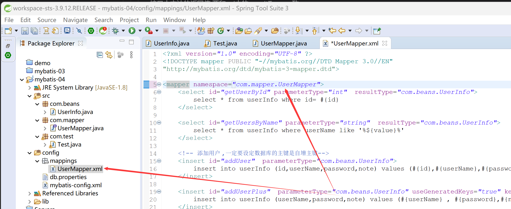
			2. mapper接口中声明的方法名,要和映射文件中的sql的id相同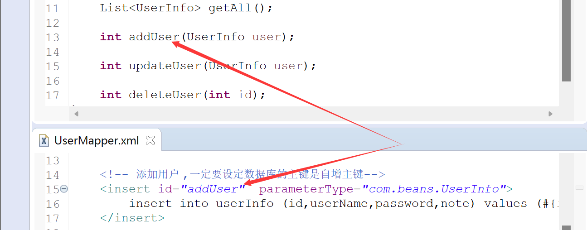
			3. 接口中方法的返回值,要和sql中的 resultType 一致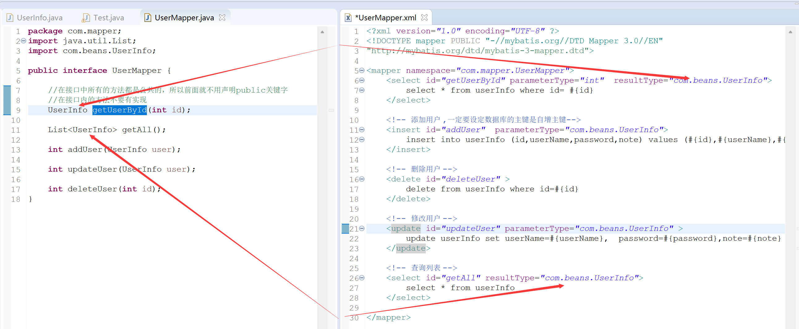
				- 对于增删改本身没有resultType这个属性
			4. 接口中的方法的参数类型,要和sql中的 parameterType 一致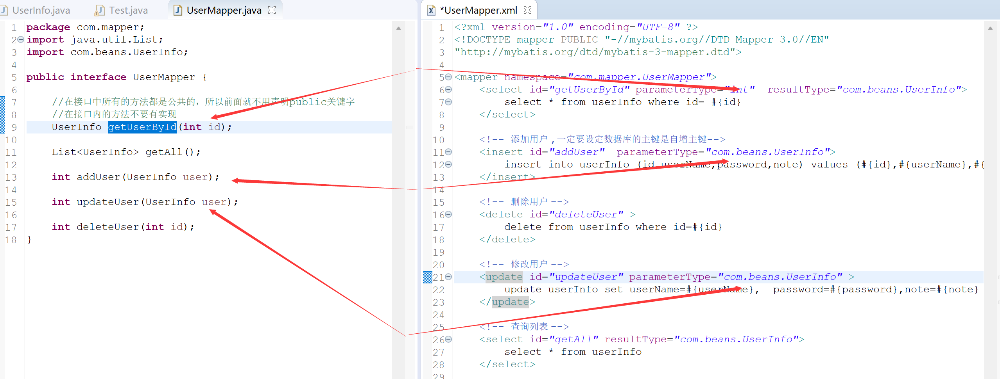
				- 对于有些情况可以不写参数类型，比如这里的delete
			5. 只要上面的条件满足了,mybatis就会自动帮我们创建这个接口的代理对象
		2. 创建dao层接口 UserMapper(我们定义的文件夹是com.mapper)
		```java
		package com.mapper;
		import java.util.List;
		import com.beans.UserInfo;
		
		public interface UserMapper {
		
			//在接口中所有的方法都是公共的，所以前面就不用声明public关键字
			//在接口内的方法不要有实现
			UserInfo getUserById(int id);
			
			List<UserInfo> getAll();
			
			int addUser(UserInfo user);
			
			int updateUser(UserInfo user);
			
			int deleteUser(int id);
		}
		```
		3.  config/mappings/ 创建一个收UserMapper.xml 的映射文件 内容如下
			- 老师的这个配置文件中之前配置过，所以resultType就没有写完整的路径
		```xml
		<?xml version="1.0" encoding="UTF-8" ?>  
		<!DOCTYPE mapper PUBLIC "-//mybatis.org//DTD Mapper 3.0//EN" 
		"http://mybatis.org/dtd/mybatis-3-mapper.dtd">  
		
		<mapper namespace="com.mapper.UserMapper">
			<select id="getUserById"   resultType="UserInfo">
				select * from userInfo where id= #{id}    
			</select>
		
			<!-- 添加用户 ,一定要设定数据库的主键是自增主键-->
			<insert id="addUser"  parameterType="userInfo" useGeneratedKeys="true" keyProperty="id" keyColumn="id">
				insert into userInfo (userName,password,note) values (#{userName} , #{password},#{note}) 
			</insert>
			
			<!-- 删除用户 -->
			<delete id="deleteUser" parameterType="int">
				delete from userInfo where id=#{id}
			</delete>
			
			<!-- 修改用户 -->
			<update id="updateUser" parameterType="UserInfo" >
				update userInfo set userName=#{userName},  password=#{password},note=#{note} where id=#{id}
			</update>
			
			<!-- 查询列表 -->
			<select id="getAll" resultType="UserInfo"> 
				select * from userInfo
			</select>
		</mapper>
		```
		4. 不要忘了在主配置文件(mybatis-config)中引入
		```xml
		<mappers>
			<mapper resource="mappings/UserMapper.xml" />
		</mappers>
		```
		5. 测试
			- 代码段
			```java
			package com.test;
			import java.io.*;
			import java.util.*;
			import org.apache.ibatis.io.Resources;
			import org.apache.ibatis.session.*;
			import com.beans.UserInfo;
			import com.mapper.UserMapper;
			
			public class Test {
				
				public static void main(String[] args) throws IOException {
					//加载类目录下的配置文件
					InputStream in= Resources.getResourceAsStream("mybatis-config.xml");
					SqlSessionFactory factory=new SqlSessionFactoryBuilder().build(in);
					SqlSession session =factory.openSession();
					
					//这个方法,就是得到mybatis帮我创建的代理对象
					UserMapper userMapper =session.getMapper(UserMapper.class);
						
					/*增
					UserInfo user=new UserInfo();
					user.setUserName("mybatis用户");
					user.setPassword("abc");
					user.setNote("中等管理员");
					userMapper.addUser(user);
					System.out.println("添加成功"); 
					
					*/
					//记得应该要有下面的session.commit();提交和session.close();关闭
					
					//查询一个
					UserInfo user= userMapper.getUserById(23);
					System.out.println(user);
					
					//更新
					user.setUserName("新用户XXX");
					user.setPassword("admin111");
					int result=userMapper.updateUser(user);
					System.out.println(result==1?"更新成功":"更新失败");
					
					//查询所有
					List<UserInfo> userList= userMapper.getAll();
					for(UserInfo u:userList) {
						System.out.println(u);
					}
					
					//删除
					result=userMapper.deleteUser(23);
					System.out.println(result==1?"删除成功":"删除失败");
					
					session.commit();
					session.close();
				}
			}			
			```
			- 测试结果
				- 测试之前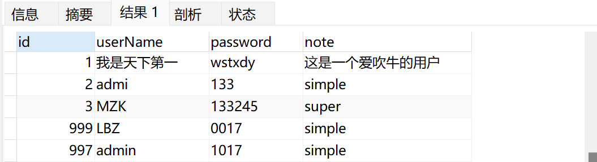
				- 测试过程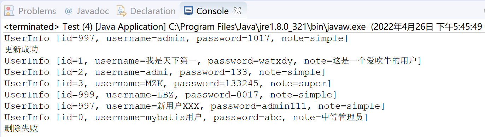
					- 删除失败是因为我们删除了一个不存在的id
				- 测试结果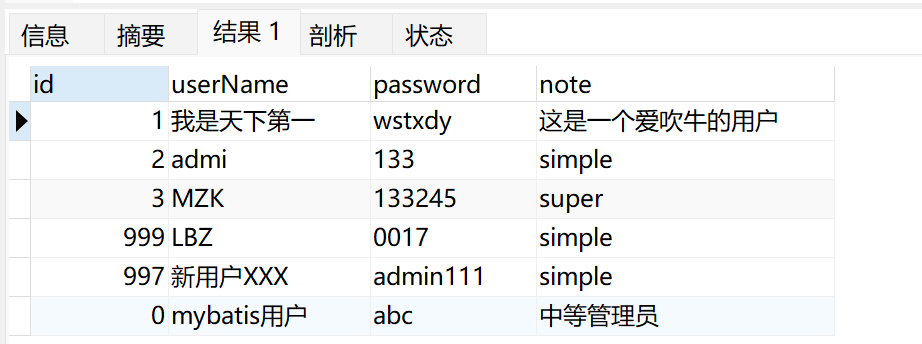
3. 映射文件的引入方式 
	- 在主配置中引入映射文件
	1. 相对于类路径的方式
	```xml
	<mappers>
		<mapper resource="mappings/UserMapper.xml" />
		<mapper resource="mappings/GoodMapper.xml" />
		<mapper resource="mappings/MemberMapper.xml" />
	</mappers>	
	```
	2. 全路径方式 -- 可以使用具体的某个盘的路径
	3. 使用类名,包名的方式 -- 用的不是太多
		- 要用这种方式,则要求映射文件的名称和接口名要一致,且位于同一包下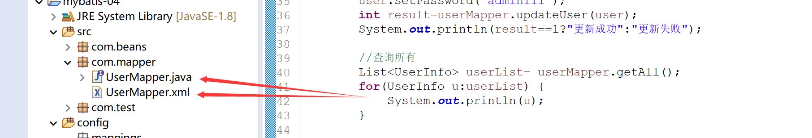
		- 代码内容
		```xml
		<mappers>
			<mapper class="com.mapper.UserMapper"  />
		</mappers>
		```
	4. 使用 mapper的方式批量加载 -- 推荐使用这个形式
		- 代码段
		```xml
		<mappers>
			<package name="com.mapper" />
		</mappers>
		```
		- 这种方式,同样要求映射文件和接口名相同,且放在接口相同的包下,它会自动加载这个包下的所有映射文件
4. 传入多个参数
	1. 输入参数类型  parameterType 的取值,只能是一个,可以是
		- 简单类型 
		- 复合类型(pojo/hashMap/包装过的pojo)
	2. 我们也可以在声明接口的时候,用注解的方式传入多个参数
		- 接口中的方法声明:
		```java
		UserInfo login(@Param("a") String userName, @Param("b") String password);  	
		//a和b可以随便换通常我们使用和后面变量相同的名字小写
		```
		-  配置文件
			- 代码段
			```xml
			<select id="login" resultType="UserInfo">   
				select * from userInfo where userName=#{a}  and password=#{b}
			</select>
			```
			- 这里面的a和b要和上接口中起的名字一致
		- 测试
		```java
		public static void main(String[] args) throws IOException {
			InputStream in= Resources.getResourceAsStream("mybatis-config.xml");
			SqlSessionFactory factory=new SqlSessionFactoryBuilder().build(in);
			SqlSession session =factory.openSession();
			UserMapper userMapper =session.getMapper(UserMapper.class);
			UserInfo user = userMapper.login("LBZ", "0017");
			System.out.println(user==null?"登陆失败":"登陆成功，信息如下："+user);
			session.commit();
			session.close();
		}
		```
		- 输出结果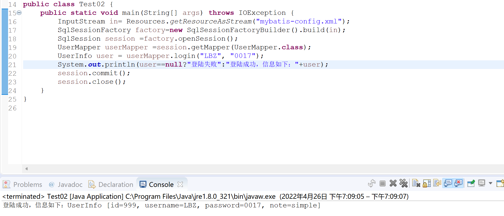
5. mybatis 配置输出sql语句
	1.  在 config 目录下,配置一个配置文件 log4j.properties
	```properties
	log4j.rootLogger=DEBUG, Console
	#Console
	log4j.appender.Console=org.apache.log4j.ConsoleAppender
	log4j.appender.Console.layout=org.apache.log4j.PatternLayout
	log4j.appender.Console.layout.ConversionPattern=%d [%t] %-5p [%c] - %m%n
	
	log4j.logger.java.sql.ResultSet=INFO
	log4j.logger.org.apache=INFO
	log4j.logger.java.sql.Connection=DEBUG
	log4j.logger.java.sql.Statement=DEBUG
	log4j.logger.java.sql.PreparedStatement=DEBUG 	
	``````
	2. 还要导入日志相关的包
		- log4j-1.2.17.jar
		- log4j-api-2.0-rc1.jar
		- log4j-core-2.0-rc1.jar
		- slf4j-api-1.7.5.jar
		- slf4j-log4j12-1.7.5.jar
	3. 这样在运行的时候,它会输出运行的sql语句,如下:
		- 输出栏
		```java
		2022-04-24 10:15:20,052 [main] DEBUG [com.mapper.UserMapper.login] - ==>  Preparing: select * from userInfo where userName=? and password=?
		2022-04-24 10:15:20,113 [main] DEBUG [com.mapper.UserMapper.login] - ==> Parameters: admin(String), 123(String)
		2022-04-24 10:15:20,140 [main] DEBUG [com.mapper.UserMapper.login] - <==      Total: 1
		```
		- 输出效果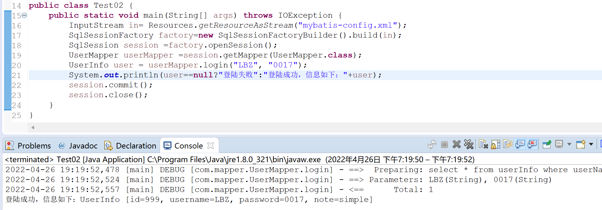
6. 动态sql
	1. mybatis 中,实现动态sql的元素有
		- if
		- choose(when  otherwise)
	    - trim
	    - where
	    - set
	    - foreach
	2. 多条件复合查询示例
		```java
		public static void main(String[] args) {
			seach(0,null,null);
			seach(10,null,null);
			seach(10,"admin",null);
			seach(10,"admin","中国");
			seach(0, null,"中国");	
		}
		static void seach(int age,String name,String country) {
			//我们写的1=1相当于True用于我们下面进行拼接使用
			String sql="select * from userInfo where 1=1"; 
			
			if(age!=0) {
				sql+=" and age="+age;
			}
			
			if(name!=null) {
				sql+= " and name= '"+name+"'";
			}
			
			if(country!=null) {
				sql+= " and country= '"+country+"'";
			}
			
			//执行
			System.out.println(sql);	
		}
		```
	3. 例 mybatis中做动态查询 ( if 的使用 )
		- xml
		```xml
		<!-- 多条件查询 -->
		<select id="selectList"   parameterType="userInfo" resultType="UserInfo" >
			select * from userInfo where 1=1
			
			<if test="id !=0">
				and id=#{id}
			</if>  
			<if test="userName!=null and userName!='' ">   
				and userName=#{userName}
			</if>
			
			<if test="password!=null and password!='' ">   
				and password=#{password}
			</if>
			  
			<if test="note!=null and note!='' ">   
				and note=#{note}
			</if>
			
		</select>
		```
		- 在接口中进行声明
		```java
		//多条件复合查询
		List<UserInfo> selectList(UserInfo user);
		```
		- 测试
			- 代码段
			```java
			 public static void main(String[] args) throws IOException {
				InputStream in= Resources.getResourceAsStream("mybatis-config.xml");
				SqlSessionFactory factory=new SqlSessionFactoryBuilder().build(in);
				SqlSession session =factory.openSession();
				
				//这个方法,就是得到mybatis帮我创建的代理对象
				UserMapper userMapper =session.getMapper(UserMapper.class);
				
				//没有任何条件限制的时候
				UserInfo user=new UserInfo();
				List<UserInfo> userList1= userMapper.selectList(user);
				userList1.forEach(System.out::println);
				
				System.out.println("--------------");
				
				//我们限制Note为simple的用户
				user.setNote("simple");
				List<UserInfo> userList2= userMapper.selectList(user);
				userList2.forEach(System.out::println);
				
				System.out.println("--------------");
				
				//我们在之前的基础上再限制密码为133
				user.setPassword("133");
				List<UserInfo> userList3= userMapper.selectList(user);
				userList3.forEach(System.out::println);
				
				System.out.println("--------------");
				
				//我们在之前的基础上再限制username为admi
				user.setUserName("admi");
				List<UserInfo> userList4= userMapper.selectList(user);
				userList4.forEach(System.out::println);
				
			}
			```
			- 没有任何限制的时候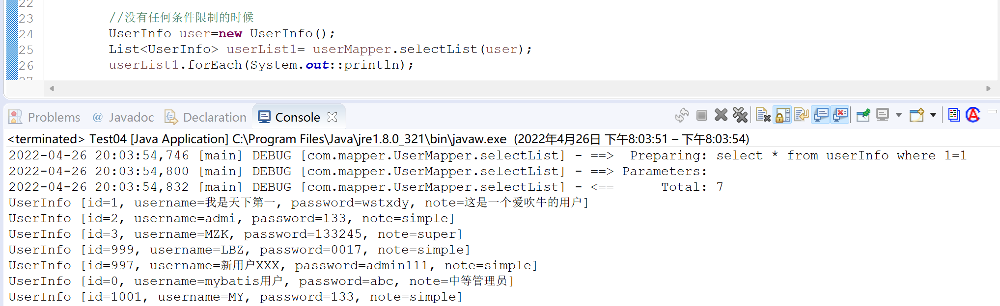
			- 限制note=simple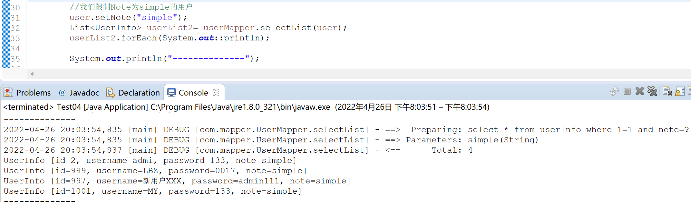
			- 限制note=simple且password=133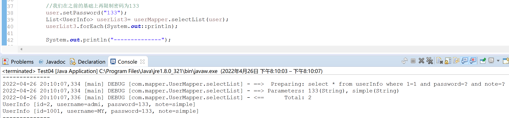
			- 限制note=simple且password=133且username=admin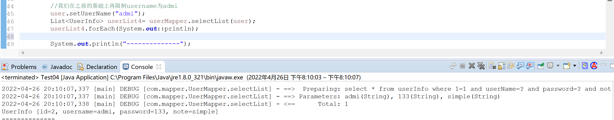
	4. choose(when  otherwise) 的使用
		- 代码段
		```xml
		<select id="dynamicSearch"  parameterType="userInfo" resultType="UserInfo">
			 select * from userInfo where 1=1
			 <choose>
				<when test="userName!=null">
					and userName=#{userName}
				</when>
				<when test="password!=null">
					and password=#{password}
				</when>
				<otherwise>
					and note =#{note}
				</otherwise>
			 </choose>
		</select>
		```
		- 当userName和password都为空的时候就执行otherwise
		- 测试和上面的一样就是换一下id名，代码Test05
	5. foreach的使用
		- 目标实现语句：select * from userInfo where id in (1,3,5,7,9)
		1. 接口中添加一个方法
		 ```java
		//根据id列表进行查询
		List<UserInfo> getUserListByIds( List<Integer> idList); 	  
		```
		2. 配置文件
		```xml
		<select id="getUserListByIds" parameterType="list" resultType="UserInfo">
			  select * from userInfo where id in     
			  <foreach collection="list" item="userId" open="(" close=")" separator=",">
				 #{userId}
			  </foreach>
		</select>
		```
		3. 测试类中调用
			- 代码段
			```java
			//List是接口，ArrayList是实现类
			List<Integer> idList=new ArrayList<>();
			idList.add(1);
			idList.add(9);
			idList.add(11);
			idList.add(12);
			idList.add(13);
			
			List<UserInfo> userList=userMapper.getUserListByIds(idList);
			userList.forEach(System.out::println);
			```
			- 测试结果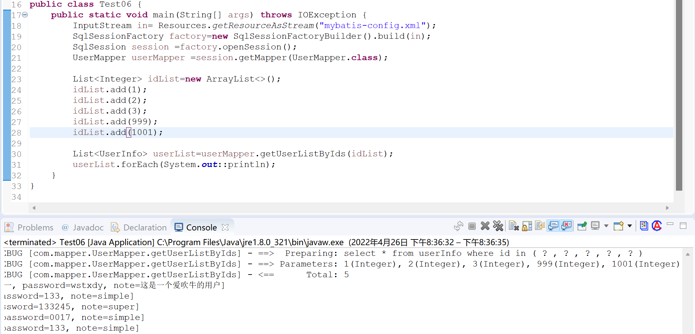
		4. 日志
		```java
		2022-04-24 11:20:33,477 [main] DEBUG [com.mapper.UserMapper.getUserListByIds] - ==>  Preparing: select * from userInfo where id in ( ? , ? , ? , ? , ? )
		2022-04-24 11:20:33,512 [main] DEBUG [com.mapper.UserMapper.getUserListByIds] - ==> Parameters: 1(Integer), 9(Integer), 11(Integer), 12(Integer), 13(Integer)
		2022-04-24 11:20:33,554 [main] DEBUG [com.mapper.UserMapper.getUserListByIds] - <==      Total: 5
		```
	6. 实在不行,我们可以用下面的方法处理复杂的查询
		- xml配置文件
		```xml
		<select id="getXXXX" parameterType="string"  resultType="UserInfo">
			${value}
		</select>
		```
		- 接口
		```java
		List<UserInfo> getXXXX(String sql);
		```
		- 测试
		```java
		UserMapper userMapper =session.getMapper(UserMapper.class);
		List<UserInfo> userList=userMapper.getXXXX("select * from userInfo where id in(1,9,11) ");
		userList.forEach(System.out::println);
		```
		- 输出结果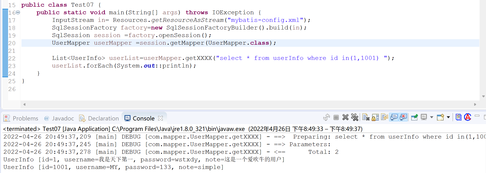
		- 相当于直接传sql语句进行查询
		- 切记：==防止用户非法注入==
7. sql片
	1. 使用sql片段示例1
		- 原配置文件状态
		```xml
		<!-- 多条件查询if -->
		<select id="selectList"   parameterType="com.beans.UserInfo" resultType="com.beans.UserInfo" >
			select * from userInfo where 1=1
			
			<if test="id !=0">
				and id=#{id}
			</if>  
			<if test="userName!=null and userName!='' ">   
				and userName=#{userName}
			</if>
			
			<if test="password!=null and password!='' ">   
				and password=#{password}
			</if> 
			 
			<if test="note!=null and note!='' ">   
				and note=#{note}
			</if> 
		</select>
		```
		- 我们假设中间的这段if可能会多次使用，那么就可以以以下的形式
		```xml
		<sql id="select_condation">
			<if test="id !=0">
				and id=#{id}
			</if>  
			<if test="userName!=null and userName!='' ">   
				and userName=#{userName}
			</if>
			
			<if test="password!=null and password!='' ">   
				and password=#{password}
			</if> 
			 
			<if test="note!=null and note!='' ">   
				and note=#{note}
			</if> 
		</sql>
		
		<!-- 多条件查询if -->
		<select id="selectList"   parameterType="com.beans.UserInfo" resultType="com.beans.UserInfo" >
			select * from userInfo where 1=1
			<include refid="select_condation" />
			<!--每当我们使用都加上面这句-->
		</select>
		```
		- 同时我们提供了一种取代1=1的方法
		```xml
		<!-- 多条件查询if -->
		<select id="selectList"   parameterType="com.beans.UserInfo" resultType="com.beans.UserInfo" >
			select * from userInfo 
			<where>
				<include refid="select_condation" />
			</where>
			
		</select>
		```
	2.  使用sql片段示例2 -- 主要看id= “cols”
		- 代码段
		```xml
		<mapper namespace="com.mapper.UserMapper">
		  <!--这里声明了一个sql片段 -->
			<sql id="cols">
				id,userName,password,note
			</sql>
			
			<select id="getUserById"   resultType="UserInfo">
				  select 
				  <include refid="cols" />
				from userInfo where id= #{id}    
			</select>
			
			 <!--这里声明了一个sql片段 -->
			<sql id="select_condation">
				<if test="id !=0">
					and id=#{id}
				</if>  
				<if test="userName!=null and userName!='' ">   
					and userName=#{userName}
				</if>
				
				<if test="password!=null and password!='' ">   
					and password=#{password}
				</if>  
			</sql>
	
			<!-- 多条件查询 ,用到了sql片段 -->
			<select id="selectList"   parameterType="userInfo" resultType="UserInfo" >
				select * from userInfo  
				<where>
					 <include refid="select_condation"  />
				</where>
			</select>
			
			<!--查询数据条数,用到了sql片段 -->
			<select id="getUserCount" parameterType="userInfo" resultType="int">
				select count(*) from userInfo
				<where>
					 <include refid="select_condation"  />
				</where>
			</select>
			...
			
		</mapper>
		```
		- 接口
		```java
		//多条件查询用户总数
		int getUserCount(UserInfo user);
		```
		- 测试类
		```java
		UserMapper userMapper =session.getMapper(UserMapper.class);
		UserInfo user=new UserInfo();
		user.setUserName("aaa");
		user.setPassword("123");
		
		List<UserInfo> userList1= userMapper.selectList(user);
		userList1.forEach(System.out::println);
		
		int count=userMapper.getUserCount(user);
		System.out.println("用户总数:"+count); 
		```
		- 输出结果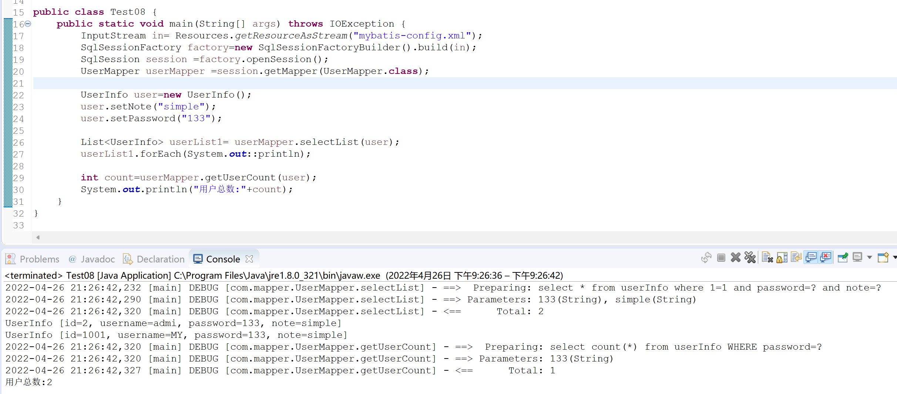
8. 注解的方式
	- 接口
	```java
	public interface UserMapper {
		
		//可以减少xml文件的负担
		@Select("select * from userInfo where id=#{id}")
		UserInfo getUserById(int id);
		
		@Select("select * from userInfo")
		List<UserInfo> getAll();
		
		@Insert("insert into userInfo (userName,password,note) values (#{userName} , #{password}, #{note} )")
		@Options(useGeneratedKeys = true,keyProperty = "id",keyColumn = "id")
		int addUser(UserInfo user);
		
		@Update("update userInfo set userName=#{userName} ,password= #{password}, note =#{note} where id =#{id}")
		int updateUser(UserInfo user);
		
		@Delete("delete from userInfo where id =#{id}")
		int deleteUser(int id);
		
		@Select("select * from userInfo where userName=#{userName} and password=#{password}")
		UserInfo login(@Param("userName") String userName, @Param("password") String password);
		
		//以下这些,没有采用注解方式,依然在xml中进行配置
		
		//多条件复合查询
		List<UserInfo> selectList(UserInfo user);
		
		//根据id列表进行查询
		List<UserInfo> getUserListByIds( List<Integer> idList); 
		
		//传入sql进行查询
		List<UserInfo> getXXXX(String sql);
		
		//多条件查询用户总数
		int getUserCount(UserInfo user);
	}
	```
9. 作业：以 Mapper 代理的方式,完成下面的表对应的 持久层代码,并测试通过
	```java
	public class User {
		private Integer userId;   //主键,自增id
	
		private String userName;  //账号
	
		private String userPass;  //密码
	
		private String userNickname;  //昵称
	
		private String userEmail;  //邮箱
	
		private String userUrl;  //用户网址
	
		private String userAvatar;   //头象图片地址
	
		private String userLastLoginIp;  //最后登录的ip地址
	
		private Date userRegisterTime;  //注册时间
	
		private Date userLastLoginTime; //最后登录时间
	
		private Integer userStatus;  //用户状态
	}
	```
	- 持久层提供以下方法
		- login() 
		- add()
		- update()
		- getUserList()
		- delete ()
		- count() 
## 第五天的内容
1. 简单介绍 
	1. Spring MVC是当前最优秀的 MVC 框架，自从Spring 2.5 版本发布后，由于支持注解配置，易用性有了大幅度的提高。
	2. Spring 3.0 更加完善，实现了对Struts 2 的超越。现在越来越多的开发团队选择了Spring MVC。
		- Spring MVC使用简单，学习成本低。学习难度小于Struts2，Struts2用不上的多余功能太多
		- Spring MVC很容易就可以写出性能优秀的程序，Struts2要处处小心才可以写出性能优秀的程序（指MVC部分）
		- 灵活
	3. 优势
		- 让我们能非常简单的设计出干净的Web层和薄薄的Web层；
		- 进行更简洁的Web层的开发；
		- 天生与Spring框架集成（如IoC容器、AOP等）；
		- 提供强大的约定大于配置的契约式编程支持；
		- 能简单的进行Web层的单元测试；
		- 支持灵活的URL到页面控制器的映射；
		- 非常容易与其他视图技术集成，如 Velocity、FreeMarker 等等，因为模型数据不放在特定的API里，而是放在一个Model里（Map数据结构实现，因此很容易被其他框架使用）；
		- 非常灵活的数据验证、格式化和数据绑定机制，能使用任何对象进行数据绑定，不必实现特定框架的API；
		- 提供一套强大的JSP标签库，简化JSP开发；
		- 支持灵活的本地化、主题等解析；
		- 更加简单的异常处理；
		- 对静态资源的支持；
		- 支持Restful风格
2. 配置核心控制器
	1. 安装tomcat
		1. 准备 安装tomcat ,比如我的就直接解压在  D:\Program Files\apache-tomcat-9.0.56
		2. 安装tomcat之前,要先配置好 JAVA_HOME 环境变量
		3. 在命令行中进行启动测试/直接运行bin中的start.up程序
			- 进行到它的bin目录下,执行 startup.bat
			- 停止tomcat 用 shutdown.bat 
		4. 然后在浏览器地址栏中访问:
			- http://localhost:8080/    能看到一个界面,证明安装成功
		5. 如果启动不成功,主要的原因可能有
	       1. 已经有tomcat在运行 , 会发生 端口冲突问题  Adress Already in use  ...
	       2. 在tomcat 下,发布有错语的项目 
	2. 连接eclipse 
		1. 在eclipse中配置和tomcat的集成 
			- [[在eclipse中配置和tomcat的集成]]
		2. 新建一个动态web项目 , 可以把它发布到tomcat服务器上测试一下
			- [[创建动态web项目]]
		3. 导包 
	        - 把所用的包,放到WEB-INF 下的lib目录中就可以
	        - 注意: 不用再手动添加 buildpath
	    4. 配置核心控制器就是一个Servlet
		    - 作用: 把所有的请求都拦过来,交给SpringMVC框架去处理
	3. 配置web.xml
	```xml
	<?xml version="1.0" encoding="UTF-8"?>
	<web-app xmlns:xsi="http://www.w3.org/2001/XMLSchema-instance" xmlns="http://xmlns.jcp.org/xml/ns/javaee" xsi:schemaLocation="http://xmlns.jcp.org/xml/ns/javaee http://xmlns.jcp.org/xml/ns/javaee/web-app_3_1.xsd" id="WebApp_ID" version="3.1">
	  <display-name>springmvc-01</display-name>
	  <welcome-file-list>
		<welcome-file>login.jsp</welcome-file>
	  </welcome-file-list>
	  
	  <!-- 核心控制器,把所有的请求拦下来交给springmvc框架处理 -->
	  <servlet>
		<servlet-name>springmvc</servlet-name>
		<servlet-class>org.springframework.web.servlet.DispatcherServlet</servlet-class>	
		<init-param>
			<param-name>contextConfigLocation</param-name>
			<param-value>classpath:springmvc-config.xml</param-value>   
			<!--上面是配置springmvc的主配置文件的名称和路径-->
		</init-param>
		<load-on-startup>1</load-on-startup>  
		<!--上面表示在容器启动的时候,就创建这个serverlet-->
	  </servlet>
	  <servlet-mapping>
		<servlet-name>springmvc</servlet-name>
		<url-pattern>/</url-pattern>   
		<!--上面表示把所有的请求都拦下来-->
	  </servlet-mapping>
	</web-app>
	```
3. springmvc 主配置文件
	- 在源文件夹下 (比如src) 建 springmvc-config.xml 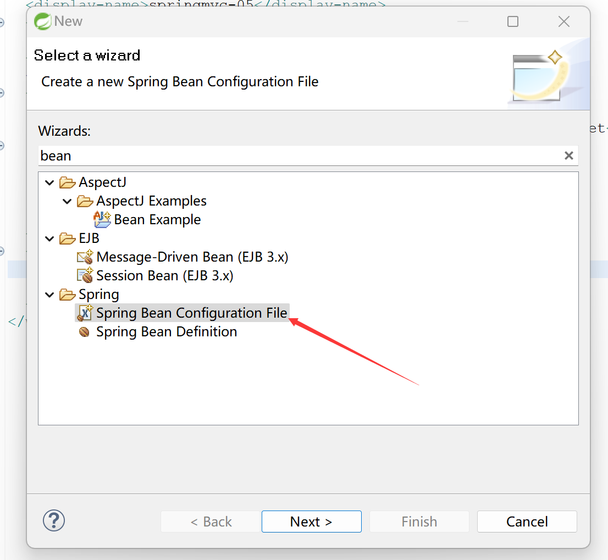
		- 依旧是new中选择other之后输入bean	
		- 依旧需要在Namespace中开启context自动扫描和mvc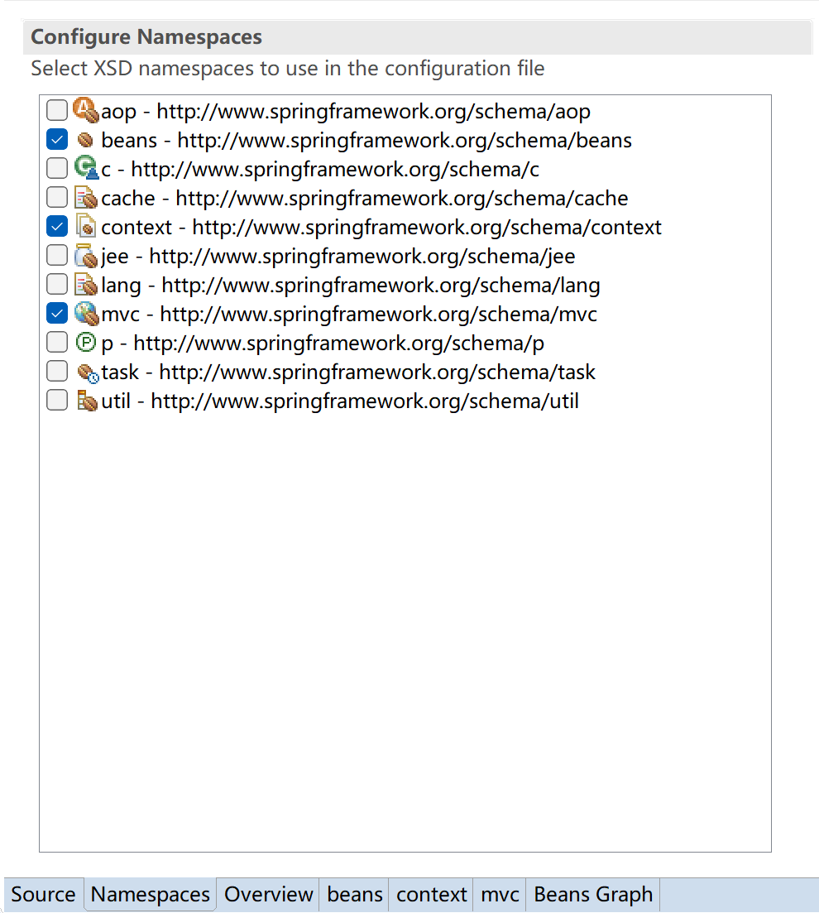
	- 内容
	```xml
	<?xml version="1.0" encoding="UTF-8"?>
	<beans xmlns="http://www.springframework.org/schema/beans"
		xmlns:xsi="http://www.w3.org/2001/XMLSchema-instance"
		xmlns:context="http://www.springframework.org/schema/context"
		xmlns:mvc="http://www.springframework.org/schema/mvc"
		xsi:schemaLocation="http://www.springframework.org/schema/mvc http://www.springframework.org/schema/mvc/spring-mvc-4.1.xsd
			http://www.springframework.org/schema/beans http://www.springframework.org/schema/beans/spring-beans.xsd
			http://www.springframework.org/schema/context http://www.springframework.org/schema/context/spring-context-4.1.xsd">
	
		<!-- 开启自动扫描 -->
		<context:component-scan base-package="com"  />
		
		<!-- 开启注解驱动 -->
		<mvc:annotation-driven /> 
		
		<!-- 视图解析器 -->
		<bean class="org.springframework.web.servlet.view.InternalResourceViewResolver">
			<property name="prefix" value="/WEB-INF/view/" />
			<property name="suffix" value=".jsp"  />
			<!--前缀是/WEB-INF/view/后缀是.jsp-->
		</bean>
	</beans>
	```
4. 控制层代码
	1. 登录页
		- WebContent/login.jsp
		```js
		<form action="${pageContext.request.contextPath}/login">    
			<!-- ${pageContext.request.contextPath} 这个写法,是得到基地址,防止路径出现问题 -->
			账号:<input name="userName"  >
			密码:<input name="password"  >
			<input type="submit" value="登录">
		</form>
		  
		   ${msg} //取出传递回来的作用域数据
		```
	2. 控制层旧
	```java
	package com.controller;
	import org.springframework.stereotype.Controller;
	import org.springframework.ui.ModelMap;
	import org.springframework.web.bind.annotation.RequestMapping;
	
	@Controller
	public class UserController {
	    @RequestMapping("/login")
	    public String login(HttpServletRequest request) {
	        String userName = request.getParameter("username");
	        String password = request.getParameter("password");
	        if("admin".equals(userName) && "123".equals(password)) {
	             return "/main";      
	        }
	        else {
	            request.setAttribute("msg","账号或密码错误，登录失败");
	            return "forward:/login.jsp";  
	        }
	    }
	}	
	```
	3. 控制层新--更好一些，功能是一样的
	```java
	package com.controller;
	import org.springframework.stereotype.Controller;
	import org.springframework.ui.ModelMap;
	import org.springframework.web.bind.annotation.RequestMapping;
	//Controller注解明确表示这个是我们的控制层
	@Controller
	public class UserController {
		@RequestMapping("/login")
		public String login(String userName,String password, ModelMap m) {
			//养成equals内容写在前面的习惯
			if("admin".equals(userName) && "123".equals(password)) {
				 return "/main";	   
				 //物理视图 = 前缀+逻辑视图+后缀  /WEB-INF/view/main.jsp
			}
			else {
				m.put("msg","账号或密码错误,登录失败");
				return "forward:/login.jsp";   
				//这个地方如果我们单纯的写/login.jsp,系统就会自动去WEB-INF/view下找
				//我们可以加上forward就不受前缀后缀影响了
			}		
		}
	}
				
	```
	4. 注意
		- 用 @RequestMapping 注解,把一个url和一个方法绑定到一起
		- 接收请求参数的时候,直接用方法上的参数进行接收 (要求参数名和请求中的参数名相同)
		- 传递作用域数据的时候,用 ModelMap 类型的对象进行传递
		- 在进行转向的时候, 直接 return 逻辑视图名就可以,它会自动帮我们拼接前后缀
5. @RequestMapping 注解	
	1. 它的作用就是把url 和方法关联到一起,一个url对应一个方法 
	2. 它可以直接写在类上,写在类上,相当于为每个方法的url前面都加上类上这个url
	3. 它有六个属性  value,method,consumers,produces,params,headers 
		- method 属性的作用: 可以控制这个方法到底处理什么样的请求,是get还是post
		- 例子：   
			- @RequestMapping(value="/login",method=RequestMethod.GET)  //这样将只处理GET请求  
			- 如果发的是post请求,将出现下面的问题:
				- HTTP状态 405 - 方法不允许		
				- 类型 状态报告
				- 消息 Request method 'POST' not supported
6. 控制层 中的方法的返回值
	1. String 类型 
		- 代码段
		```java
		@RequestMapping(value="/login")
		public String login(String userName,String password, ModelMap m) {
			if("admin".equals(userName) && "123".equals(password)) {
				 return "/main";	   //物理视图 = 前缀+逻辑视图+后缀  /WEB-INF/view/main.jsp
			}
			else {
				m.put("msg","账号或密码错误,登录失败");
				return "forward:/login.jsp";   
			}		
		}
		```
		- String类型的返回值,代表的是逻辑视图的名称 物理视图 = 前缀+逻辑视图+后缀 
		- 注意:带有forward: 或  redirect:  这样的视图是不受前后缀影响的
	2. ModelAndView 类型 
		- //例 用户列表查询 
		1.  用户信息实体类 -- package com.beans;
		```java
		public class UserInfo {
			public UserInfo(int id, String userName, String password, String note) {
				this.id = id;
				this.userName = userName;
				this.password = password;
				this.note = note;
			}
			
			public UserInfo() {	
			}
			
			private int id;
			private String userName;
			private String password;
			private String note;
			...get set 方法
		}
		```
		2. 模拟的dao层
		```java
		package com.dao;
		import java.util.ArrayList;
		import java.util.List;
		import com.beans.UserInfo;
		
		public class UserDao {
			private List<UserInfo> userList;
			{
				userList=new ArrayList<UserInfo>();
				userList.add(new UserInfo(1,"admin","123","一号用户"));
				userList.add(new UserInfo(2,"root","root","二号用户"));
				userList.add(new UserInfo(3,"sa","sa","三号用户"));
				userList.add(new UserInfo(4,"scott","scott","四号用户"));
			}
		
			public void addUser() {
			}
			
			public int deleteUser() {
				return 1;
			}
			
			public UserInfo getUserById() {
				return null;
			}
			
			public List<UserInfo> getAll(){
				return userList;
			}	
		}
		```
		3. 控制层
		```java
		package com.controller;
		import java.util.List;
		
		import org.springframework.stereotype.Controller;
		import org.springframework.ui.ModelMap;
		import org.springframework.web.bind.annotation.RequestMapping;
		import org.springframework.web.servlet.ModelAndView;
		
		import com.beans.UserInfo;
		import com.dao.UserDao;
		
		@Controller @RequestMapping("/user")
		public class UserController {
			UserDao dao=new UserDao();
			
			@RequestMapping(value="/login")
			public String login(String userName,String password, ModelMap m) {
				if("admin".equals(userName) && "123".equals(password)) {
					 return "/main";	   
					 //物理视图 = 前缀+逻辑视图+后缀  /WEB-INF/view/main.jsp
				}
				else {
					m.put("msg","账号或密码错误,登录失败");
					return "forward:/login.jsp";   
				}		
			}	
			//查询所有
			@RequestMapping("/getAll")
			public ModelAndView getAll() {
				List<UserInfo> userList= dao.getAll();		
				ModelAndView mv=new ModelAndView();
				mv.addObject("userList",userList); 
				mv.setViewName("user-manager");    //设置视图名称--在哪个页面显示
				return mv;
			}
		}
		```
		4. 页面
		```html
		<%@ taglib uri="http://java.sun.com/jsp/jstl/core" prefix="c" %>							
		<table>
			<tr>
				<td>id</td>
				<td>账号</td>
				<td>密码</td>
				<td>备注</td>
			</tr>
			<c:forEach var="u" items="${userList }">
			<tr>
				<td>${u.id}</td>
				<td>${u.userName}</td>
				<td>${u.password}</td>
				<td>${u.note}</td>
			</tr>
			</c:forEach>	
		</table>
		```
		5. 访问 http://localhost:8080/springmvc-01/user/getAll
	3. 没有返回值 void 类型,转向的时候,可以用  request对象直接转向
	4. 返回json格式的数据
## 第六天的内容
1. 参数绑定与值的传递
	- 页面在发起请求的时候,如何把数据传给服务端(控制层),如何在控制层进行模型数据的传递 
	- 在控制层的方法上,可以用以下几种类型的参数
	1. 传统的Servlet中常用的几个类型
		- HttpServletRequest
    	- HttpServletResponse
    	- HttpSession
    2. 用于传递模型数据 
	    - Model
    	- ModelMap
    	- Map
    	- 例: 用各种方式传递模型数据(作用域数据)
		```java
		@RequestMapping(value="/login")
		public String login(String userName,String password, ModelMap m, Model model,Map map, HttpSession session) {
			if("admin".equals(userName) && "123".equals(password)) {
				 session.setAttribute("session_userName", userName);
				 
				 return "/main";	   //物理视图 = 前缀+逻辑视图+后缀  /WEB-INF/view/main.jsp
			}
			else {
				//下面演示了用三种方式传递模型数据
				m.put("msg","账号或密码错误,登录失败");
				model.addAttribute("info","真是个白痴,连用户名都记不住");
				map.put("str", "不要紧,谁还不能有点错呢");
				
				return "forward:/login.jsp";   
			}		
		}
		```
		- 在 login.jsp上 
		```js
		<form action="${pageContext.request.contextPath}/user/login" method="post">
			账号:<input name="userName"  >
			密码:<input name="password"  >
			<input type="submit" value="登录">
		</form>
					  
		  ${msg}
		
		  ${info }
			
		  ${str }
			
		  ${session_userName }  //注意,这个是取session中的数据
	
		```
	3. pojo类型--普通类
		- 例：用户添加
		1. main.jsp中的导航上发起请求
		```js
		<ul>
			<!--程序中不可以直接从一个界面访问另外一个界面，因为是安全目录-->
			<!--下面的写法相当于绕行服务端，之后间接的到达-->
			<li> <a href="${pageContext.request.contextPath}/user/add" >用户添加</a>  </li>
			<li> <a>用户列表</a>  </li>
			<li> <a>退出登录</a>  </li>
		</ul>
		```
		2. 控制层
		```java
		//转向到用户添加页面,只处理GET请求
		@RequestMapping(value="/add", method=RequestMethod.GET)  
		public String gotoAdd() {
			return "user-add";
		}
		```
		3. 页面 WEB-INF/view/user-add.jsp
			- 代码段
			```js
			<form action="${pageContext.request.contextPath}/user/add" method="post">
				账号:	<input name="userName" >  <br />
				密码:	<input name="password" > <br />
				备注:	<textarea  name="note"></textarea> <br />
					<input type="submit" value="提交"  onclick="return confirm('确定要提交吗')">
			</form>
			${msg} 
			```
			- 页面效果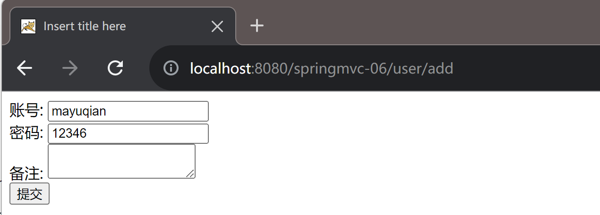
			- 提交会有网页提示窗口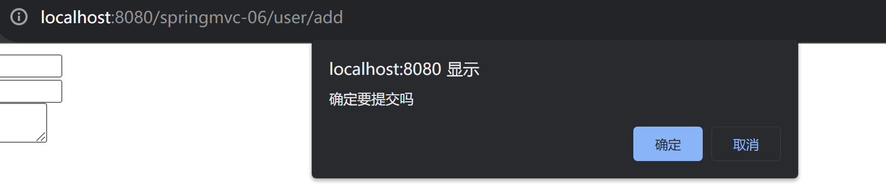
			- 原界面效果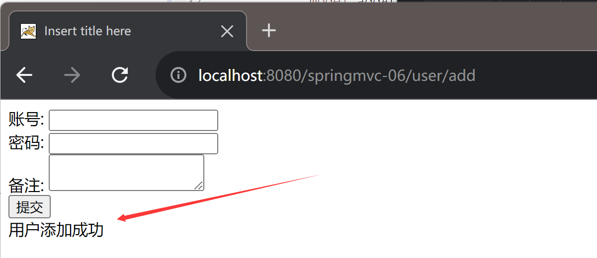
			- 通过访问localhost:8080/springmvc-06/user/getAll可以看到成功加入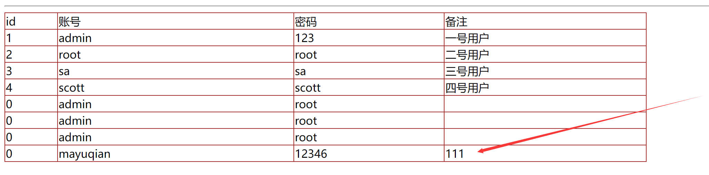
		4. 控制层中的添加方法
			- 代码段
			```java
			//注意,它只处理POST请求	
			@RequestMapping(value="/add", method=RequestMethod.POST)  
			public String add(UserInfo user, ModelMap m) {  
				//注意,这里直接用 pojo类型的参数
				dao.addUser(user);
				m.put("msg","用户添加成功");
				return "user-add";
			}	
			```
			- 可以看到,上面的例子中,参数直接用 UserInfo user 这样的类型,就可以接收到表单中提交上来的数据
			- 前题是表单中的字段名要和参数对象的字段名相同
		5. 附: 关于日期类型的处理
			- 在 UserInfo 实体类上加一个日期类型字段
				- private Date birthday;
			- 在数据库中,要用Datetime类型对应
			- 用户添加页面user-add添加一个元素
			```js
			 生日:  <input name="birthday"  >  <br />
			```
			- 控制层
			```java
			@RequestMapping(value="/add", method=RequestMethod.POST)
			public String add(UserInfo user, ModelMap m) {
				System.out.println(user.getBirthday());
				dao.addUser(user);
				m.put("msg","用户添加成功");
				return "user-add";
			}
			```
			- 启动,运行,添加的时候,生日填入 2000-12-20 提交,发现出现了400 问题其实,400是在用springmvc框架时常见的错误,主要是提交的请求数据类型和服务端想要的数据类型不匹配造成的(比如服务端想要数值类型,但客户端提交的是非法字符串)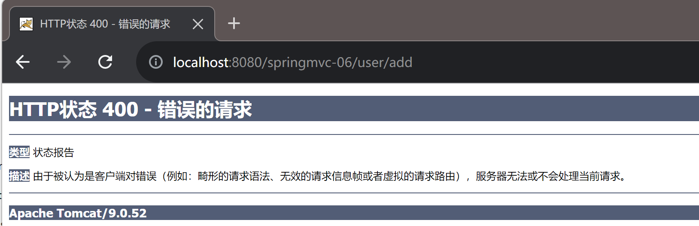
			- 处理方式: 在实体类中的字段上用注解--可以不填
				- 代码段
				```java
				@DateTimeFormat(pattern = "yyyy-MM-dd")
				private Date birthday;
				```
				- 处理后打印端格式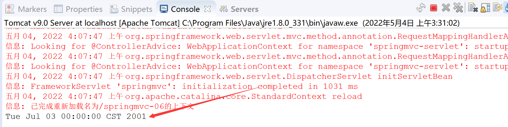
			- 月份是1-9月都要加0变成01-09月
			- 我们最好做成下拉菜单后进行客户端校验，减少因为用户输入产生的不必要的麻烦
		3. 附:关于乱码问题--拿来直接粘贴
			-  对于请求提交到服务端以后出现的中文乱码,只要在web.xml中配置一个过滤器就可以
		```xml
		<!-- 配置一个处理乱码的过滤器 -->
		  <filter>
			<filter-name>codeFilter</filter-name>
			<filter-class>org.springframework.web.filter.CharacterEncodingFilter</filter-class>
			<init-param>
				<param-name>encoding</param-name>
				<param-value>UTF-8</param-value>
			</init-param>
		  </filter>
		  <filter-mapping>
				<filter-name>codeFilter</filter-name> 
				<url-pattern>/*</url-pattern>  
				<!--上面这句表示我们要拦截所有的文件-->                                 
		  </filter-mapping>
		```
	4. 简单类型
		- 代码段
		```java
		@RequestMapping(value="/login")
		public String login(String userName,String password, ModelMap m) {
			if("admin".equals(userName) && "123".equals(password)) {	 
				....
			}
			else {
			....
			}		
		}		
		```
		- 上例用的是简单类型 ,前提是提交字段(userName,password)必须和控制层方中参数的名称相同
	5. 数组类型
		- 删除多个选中用户user-manager.jsp
		```js
		<form action="${pageContext.request.contextPath }/user/deleteUsers" method="post">
			<table>
				<tr>
					<td></td>
					<td>id</td>
					<td>账号</td>
					<td>密码</td>
					<td>备注</td>
				</tr>
				<c:forEach var="u" items="${userList }">
				<tr>
					<td><input type="checkbox" name = "ids" value = "${u.id}" ></td>
					<td>${u.id}</td>
					<td>${u.userName}</td>
					<td>${u.password}</td>
					<td>${u.note}</td>
				</tr>
				</c:forEach>		
			</table>
			<input type="submit" value="删除所选" onclick="return confirm('确定要删除所选用户吗')">
		</form>
		```
		- 控制层
		```java
		@RequestMapping("/deleteUsers")
		public String deleteUsers( Integer [] ids, ModelMap m ) {
			dao.deleteUsers(ids);
			
			List<UserInfo> userList= dao.getAll();		
			m.put("userList",userList);
			return "user-manager";		
		}
		```
		- dao层
		```java
		//根据id列表删除多个用户
		public void deleteUsers(Integer[] ids) {
			List<UserInfo> tmpList=new ArrayList<>();
			for(int id:ids) {
				for(UserInfo u: userList) {
					if(u.getId()==id) {
						tmpList.add(u);
					}
				}	
			}
			
			for(UserInfo u:tmpList) {
				userList.remove(u);
			}
		}
		```
	6. List类型 (主要用于批量修改,略)
2. 数据回显
	- 例: 用户修改功能 
	1. 从user-manger.jsp上发起请求
	```js
	<table>
		<tr>
			<td></td>
			<td>id</td>
			<td>账号</td>
			<td>密码</td>
			<td>备注</td>
			<td>操作</td>
		</tr>
		<c:forEach var="u" items="${userList }">
		<tr>
			<td><input type="checkbox" name="ids" value="${u.id}"></td>
			<td>${u.id}</td>
			<td>${u.userName}</td>
			<td>${u.password}</td>
			<td>${u.note}</td>
			<td> <a href="${pageContext.request.contextPath }/user/update?id=${u.id}">修改</a>  | <a  href="">删除</a></td>
		</tr>
		</c:forEach>		
	</table>
	```
	2. 控制层
	```java
	@RequestMapping(value="/update", method=RequestMethod.GET)
	public String goToUpdate(int id,ModelMap m) {
		UserInfo user= dao.getUserById(id);
		m.put("user",  user);
		return "user-update";		
	}
	```
	3. dao层
	```java
	public UserInfo getUserById(int id) {
		for(UserInfo u:userList) {
			if(u.getId()==id) {
				return u;
			}
		}
		
		return null;
	}
	```
	4. WEB-INF/view/user-update.jsp
	```js
	<form action="这里待处理" method="post">
			<input type="hidden" name="id" value="${user.id }" >
	账号:	<input name="userName" value="${user.userName }" >  <br />
	密码:	<input name="password" value="${user.password }"> <br />
	备注:	<textarea  name="note"> ${user.note }</textarea> <br />
	
	<input type="submit" value="提交"  onclick="return confirm('确定要提交吗')">
	
	</form>
	```
	5. 提交表单,进行真正的修改--user-update.jsp
		- 表单的提交地址:
		```js
		<form action="${pageContext.request.contextPath }/user/update" method="post">
		  ...
		</form>
		
		${msg}
		```
	6. 控制层
	```java
	//真正的提交表单,修改用户信息
	@RequestMapping(value="/update", method=RequestMethod.POST)
	public String update(UserInfo user,ModelMap m) {
		dao.updateUser(user);
		
		//回传数据,目的是为了回显
		m.put("user", user);
		m.put("msg","用户修改成功");
		return "user-update";
	} 
	
	/*也可以用  @ModelAttribute 这个注解,处理数据回传
	@RequestMapping(value="/update", method=RequestMethod.POST)
	public String update(@ModelAttribute("user") UserInfo user,ModelMap m) {
		dao.updateUser(user);
		m.put("msg","用户修改成功了,哈哈");
		return "user-update";
	} 
	*/
	```
	7. dao层 
	```java
	private static List<UserInfo> userList;
		
		static {
			userList=new ArrayList<UserInfo>();
			userList.add(new UserInfo(1,"admin","123","一号用户"));
			userList.add(new UserInfo(2,"root","root","二号用户"));
			userList.add(new UserInfo(3,"sa","sa","三号用户"));
			userList.add(new UserInfo(4,"scott","scott","四号用户"));
		}
		
		//把原来的换成新的
		public void updateUser(UserInfo user) {
			for(int i=0;i<userList.size();i++) {
				if(userList.get(i).getId()==user.getId())
				{
					userList.set(i, user);
				}
			}
		}
	```
3. 用户删除
	1. 请求发起
	```js
	<tr>
		<td><input type="checkbox" name="ids" value="${u.id}"></td>
		<td>${u.id}</td>
		<td>${u.userName}</td>
		<td>${u.password}</td>
		<td>${u.note}</td>
		<td> 
			<a href="${pageContext.request.contextPath }/user/update?id=${u.id}">修改</a>  |
  <a href="${pageContext.request.contextPath }/user/delete?id=${u.id}" onclick="return confirm('确定要删除用户吗')">删除</a>
		</td>
	</tr>
	```
	2. 控制层
	```java
	@RequestMapping("/delete")
	public String  delete(Integer id,ModelMap m) {
		dao.deleteUser(id);
		
		/* 我们也可以把用户列表重新查询一下放到作用域中传过去
		List<UserInfo> userList=dao.getAll();
		m.put("userList", userList);
		return "user-manager"; 
		*/
		
		return "forward:/user/getAll";
	}			
	```
4. 退出登录
	- 退出登录,主要作的动作就是清除留在服务端的 session 信息
	1. 发起请求
	```js
	<ul>
		<li> <a href="${pageContext.request.contextPath}/user/add" >用户添加</a>  </li>
		<li> <a href="${pageContext.request.contextPath}/user/getAll" >用户列表</a>  </li>
		<li> <a href="${pageContext.request.contextPath}/user/logout" onclick="return confirm('确定要退出吗')">退出登录</a>  </li>
	</ul>
	```
	2. 控制层
	```java
	@RequestMapping("/logout")
	public String logout(HttpSession session) {
		//将session中的所有数据全清除
		//推出账户的时候就要清除数据
		session.invalidate();
		return "forward:/login.jsp";	
	}
	```
5. 静态资源文件的引入
	1. 在 WebContent 下建一个static 目录,里面放所有的静态资源
	2. WebContent 
		- html     -welcome.html
		- css       -style.clss
		- images -cat.jpg
	3. welcome.html
	```html
	<head>
		<link rel="stylesheet" type="text/css" href="../css/style.css" ></link>
	</head>
	<body>
		<h1>信息管理系统</h1>
		<hr />
		
		
	</body>
	```
	4. login.jsp中也引入一些静态内容:
	```js
	<html>
	<head>
	<meta charset="UTF-8">
	<title></title>
	 <link rel="stylesheet" type="text/css" href="${pageContext.request.contextPath}/static/css/style.css"></link>
	</head>
	<body>
	  <h1>登录</h1>
	  
	  
	  <form action="${pageContext.request.contextPath}/user/login" method="post">
		账号:<input name="userName"  >
		密码:<input name="password"  >
		<input type="submit" value="登录">
	  </form>
		
	</body>
	</html>
	```
	5. 出现问题
		- 现在直接启动项目,访问login.jsp  我们发现页面能看到,但里面引的图片和css样式无效
		- 访问 static/html/welcome.html ,直接404,找不到
	6. 原因
		- springmvc拦截了所有的请求,对于静态资源( html,js, css, 图片) ,拦下以后,就没再处理,我们需要进行一下映射
	7. 我们要在项目中,进行静态资源的映射 -- spring
		- 代码段
		```js
		<!-- 静态资源映射 -->
			<mvc:resources location="/static/" mapping="/static/**"  />
		```
		- 再访问, 就可以看到正确的页面了
6. restfull风格
	1. REST这个词，是Roy Thomas Fielding在他2000年的博士论文中提出的HTTP协议（1.0版和1.1版）的主要设计者、Apache服务器软件的作者之一、Apache基金会的第一任主席
	2. 长期以来，软件研究主要关注软件设计的分类、设计方法的演化，很少客观地评估不同的设计选择对系统行为的影响。而相反地，网络研究主要关注系统之间通信行为的细节、如何改进特定通信机制的表现，常常忽视了一个事实，那就是改变应用程序的互动风格比改变互动协议，对整体表现有更大的影响。我这篇文章的写作目的，就是想在符合架构原理的前提下，理解和评估以网络为基础的应用软件的架构设计，得到一个功能强、性能好、适宜通信的架构REST，即 Representational State Transfer的缩写。我对这个词组的翻译是 "表现层状态转化"。如果一个架构符合REST原则，就称它为 RESTful 架构
	3. 关于 Representational State Transfer (表现层状态转化) 的理解
		1. REST的名称"表现层状态转化"中，省略了主语。"表现层"其实指的是"资源"（Resources）的"表现层"。网络上的一个具体信息,可以用一个URI（统一资源定位符）指向它
		2. Representation 表现层
			- "资源"是一种信息实体，它可以有多种外在表现形式。我们把"资源"具体呈现出来的形式，叫做它的"表现层"（Representation）。
	        - 比如，文本可以用txt格式表现，也可以用HTML格式、XML格式
	        - URI只代表资源的实体，不代表它的形式。严格地说，有些网址最后的".html" 后缀名是不必要的 因为这个后缀名表示格式，属于 "表现层" 范畴，而URI应该只代表"资源"的位置。它的具体表现形式，应该在HTTP请求的头信息中用Accept和Content-Type字段指定，这两个字段才是对"表现层"的描述。
	    3. State Transfer 状态转化
		    - HTTP协议，是一个无状态协议。这意味着，所有的状态都保存在服务器端。因此，如果客户端想要操作服务器，必须通过某种手段，让服务器端发生"状态转化"（State Transfer）。而这种转化是建立在表现层之上的，所以就是"表现层状态转化"。
		    - 客户端用到的手段，只能是HTTP协议。具体来说，就是HTTP协议里面，四个表示操作方式的动词：GET、POST、PUT、DELETE。它们分别对应四种基本操作：
			    - GET用来获取资源
			    - POST用来新建资源（也可以用于更新资源）
			    - PUT用来更新资源
			    - DELETE用来删除资源
			- URL		   
				- http://localhost:8080/UserServlet?flag=delete&id=10  
				- Rest=>http://localhost:8080/UserServlet/10
				- http://localhost:8080/UserServlet?flag=add&name=admin&password=123&note=foolish
				- Rest=>http://localhost:8080/UserServlet/admin/123/foolish
			- Rest风格的删除
				- 代码段
				```js
				<a href="${pageContext.request.contextPath }/user/del/${u.id}" >Rest风格删除</a>
				```
				- 控制层
				```java
				@RequestMapping("/del/{xxx}")
				public String del(@PathVariable("xxx") Integer id ) {
					dao.deleteUser(id);
					return "forward:/user/getAll";
				}
				```
				- 效果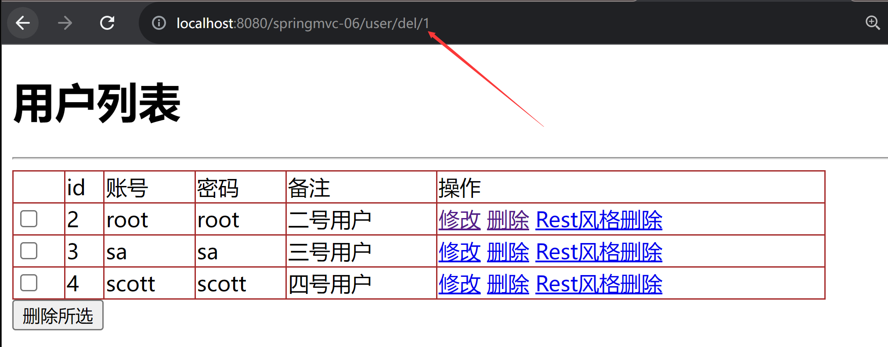
				- 例 Rest风格传入多个参数--单纯测试没有实际功能
				```java
				@RequestMapping("test/{a}/{b}/{c}")
				public String test(@PathVariable("a") String a, @PathVariable("b") String b, @PathVariable("c") int c) {
					System.out.println(a);
					System.out.println(b);
					System.out.println(c);
					return "xxxxxx";
				}
				```
			- 访问  http://localhost:8080/springmvc-02/user/test/firstcat/seconddog/99
			- 界面会是404但是有输出效果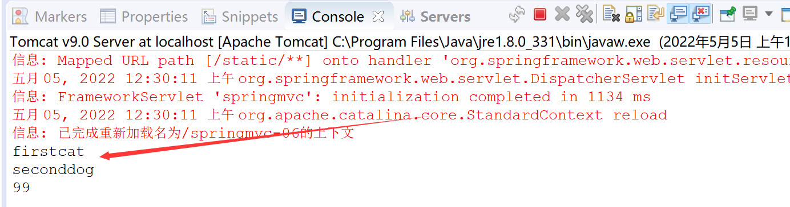
7. 文件上传
    1. 配置文件 
	    - 代码段
		```xml
		<bean id="multipartResolver" class="org.springframework.web.multipart.commons.CommonsMultipartResolver">
			<property name="defaultEncoding" value="UTF-8" />
			<property name="maxUploadSize" value="6000000" />
			<property name="uploadTempDir" value="uploadTempDir"  />
		</bean>
		```
		- 最大文件大小:6000000字节 1024字节=1k
		- 上传文件的临时目录未uploadTempDir
	2. 上传页面 
		- 代码段
		```js
		<form action="${pageContext.request.contextPath}/user/add"  method="post" enctype="multipart/form-data">
			账号:	<input name="userName" >  <br />
			密码:	<input name="password" > <br />
			备注:	<textarea  name="note"></textarea> <br />
			照片: <input type=file name="uploadphoto" >
				<input type="submit" value="提交"  onclick="return confirm('确定要提交吗')">
		</form>
			${msg} 
		```
		- 要注意三点
			- 表单提交方式必须是post
			- 必须这样写: enctype="multipart/form-data"
			- 注意文件上传组件 "uploadphoto" 这个名字,在控制层中要用到这个名称	
	3. 控制层
	```java
	@RequestMapping(value="/add", method=RequestMethod.POST)
	public String add(UserInfo user, MultipartFile uploadphoto, HttpServletRequest request,  ModelMap m) throws IllegalStateException, IOException {
		user.setPhoto(uploadphoto.getOriginalFilename());
		dao.addUser(user);
		
		System.out.println("photo.getContentType(): " + uploadphoto.getContentType());
		System.out.println("photo.getName(): " + uploadphoto.getName());  //得到上传字段的名称
		System.out.println("photo.getOriginalFilename(): " + uploadphoto.getOriginalFilename());  //得到文件名称
		System.out.println("photo.getSize(): " + uploadphoto.getSize());  //文件大小
		
		//得到这个目录所对应的物理路径(这个地址是在web服务器上)
		String realPath =request.getServletContext().getRealPath("/upload-files");
		File destFile=new File(realPath,uploadphoto.getOriginalFilename());
		
		//上传transferTo接收的是文件类型
		uploadphoto.transferTo(destFile);
	
		m.put("msg","用户添加成功");	
		return "user-add";
	}
	```
	4. 实体类中添加一个字段,代表用户头象地址
		- private String photo;
	5. 如果显示出图片, 在用户列表页面中显示:   
	```js
	<td> </td>
	```
	6. 不要忘了在主配置文件中,把 upload-files 这个目录做一下映射,要不然看不到图片
	```js
	<mvc:resources location="/upload-files/" mapping="/upload-files/**"  />
	```
## 第七天的内容
1. 今日任务
	1. 搭建一个基于springmvc架构的项目 ,放到tomcat容器中能运行
	2. 完成一个登录功能 
	3. 完成一个主界面的设计
         - 添加用户 (最好能上传图片)
         - 用户列表 (最好能显示出图片)
            - 修改用户
            - 删除用户
         - 退出登录
2. 附: 对应的实体类
	- 代码段
		```java
		public class User {
			private Integer userId;   //主键,自增id
		
			private String userName;  //账号
		
			private String userPass;  //密码
		
			private String userNickname;  //昵称
		
			private String userEmail;  //邮箱
		
			private String userUrl;  //用户网址
		
			private String userAvatar;   //头象图片地址
		
			private String userLastLoginIp;  //最后登录的ip地址
		
			private Date userRegisterTime;  //注册时间  
		
			private Date userLastLoginTime; //最后登录时间
		
			private Integer userStatus;  //用户状态
		}
		```
	- 对于日期类型,数据库中用 dataTime 类型,
	- 实体类中的字段,用java.util.Date 类型 
		
