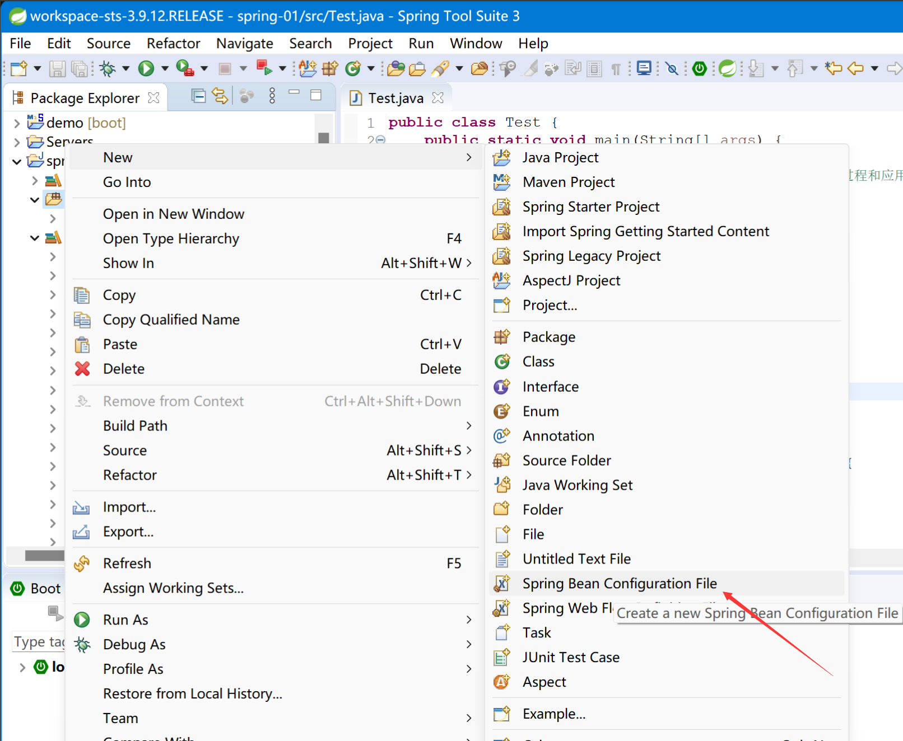
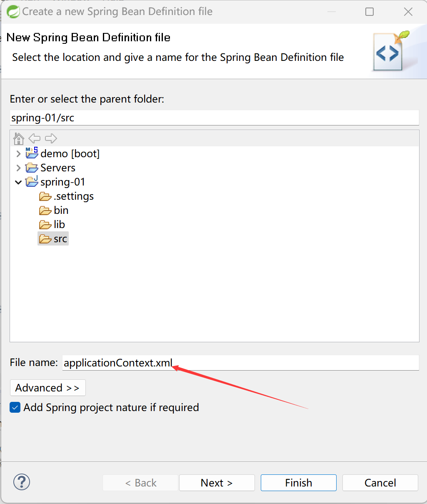
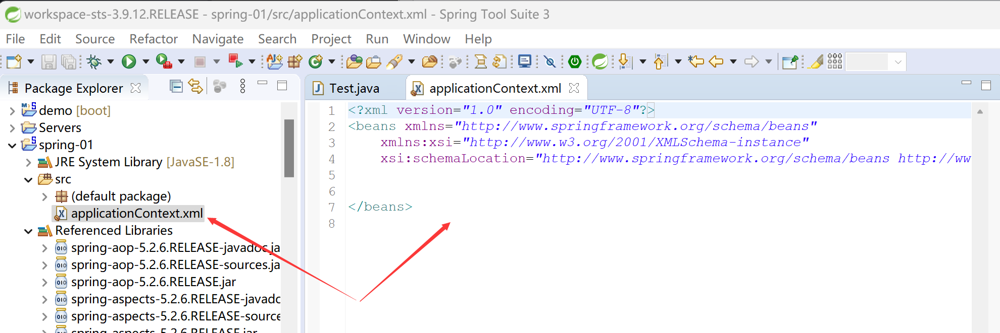

# 配置文件
1. 新建一个配置文件
	1. 步骤一
	2. 步骤二
		- 名字不重要，但是我们习惯用beans.xml或applicationContext.xml做名字
		- 直接finish就Ok了
	3. 步骤三
	4. 对于eclipse和STS4就没有Spring Bean Configuration File
		- 方法一：安装相关的插件
		- 方法二：单纯的创建一个File，将上述内容粘贴进去即可
		```xml
		<?xml version="1.0" encoding="UTF-8"?>
		<beans xmlns="http://www.springframework.org/schema/beans"
			xmlns:xsi="http://www.w3.org/2001/XMLSchema-instance"
			xsi:schemaLocation="http://www.springframework.org/schema/beans http://www.springframework.org/schema/beans/spring-beans.xsd">
		</beans>
		```
